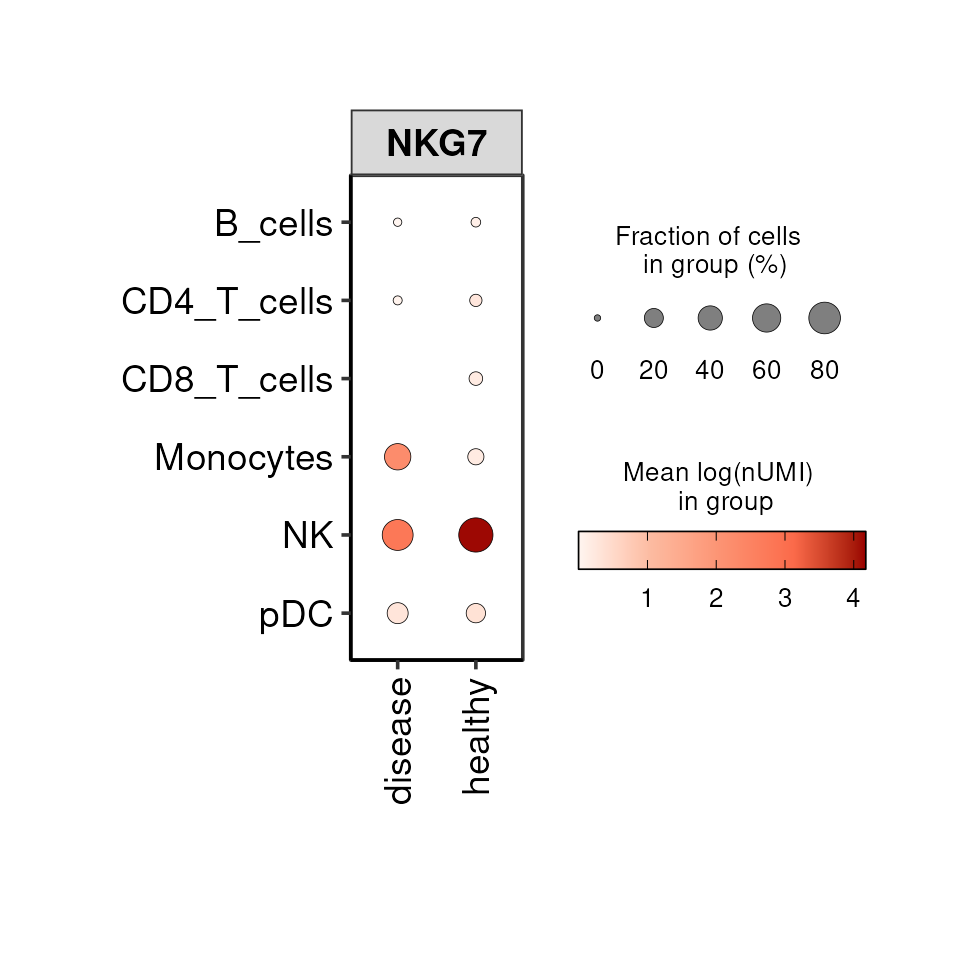
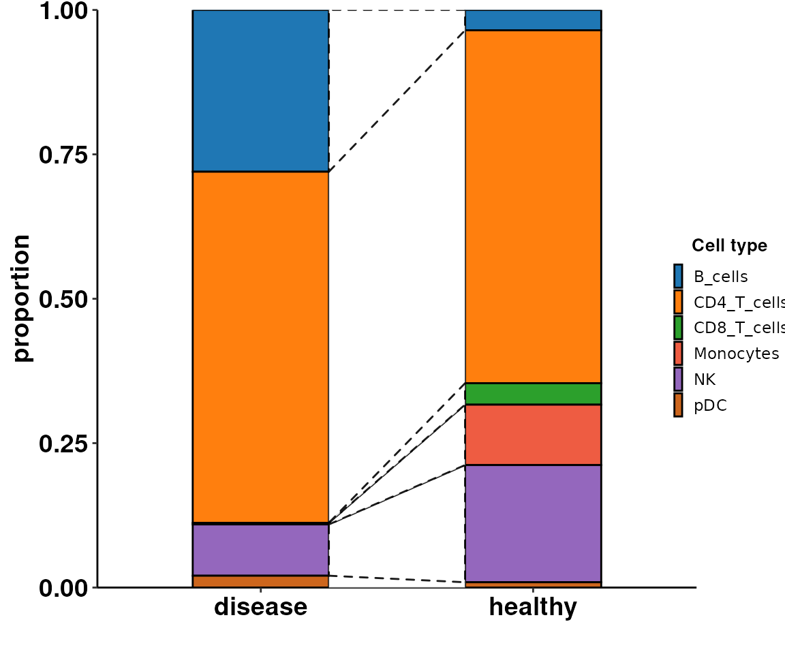
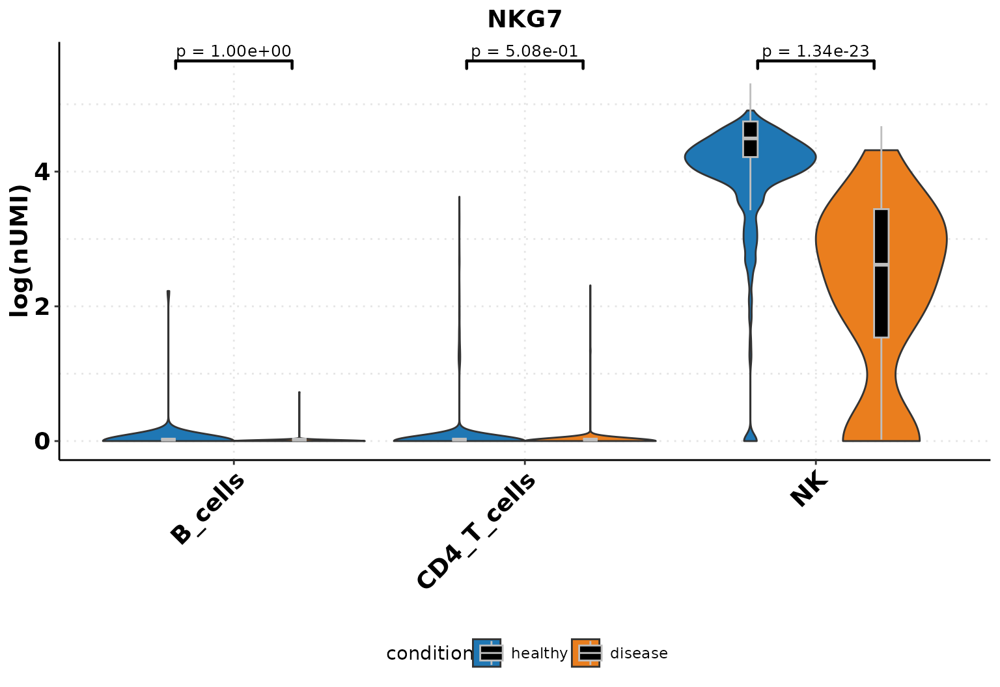
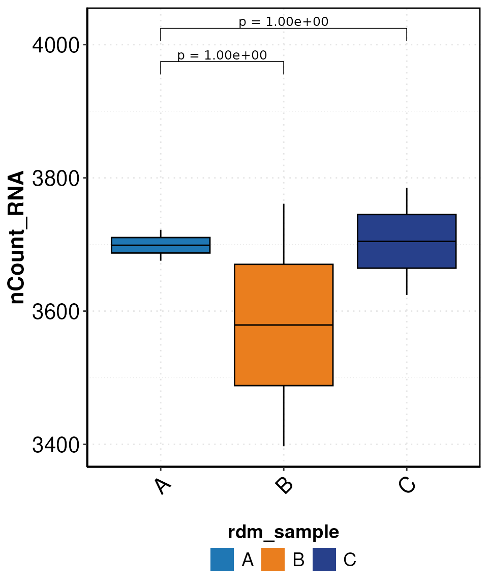

# Usage of functions

In this tutorial we compile examples on how to use the different
functions available in the R package. You can refer to previous tutorial
to see how to use CellBender and perform quality control and basic
downstream analysis of sc/snRNA-seq. We are going to use the object
generated in the section: Quality control of sc/snRNA-seq.

### Libraries & Set-Up

### Dotplot

The `DO.Dotplot` function generates a plot in a similar manner as the
Dotplot function implemented in
[*scanpy*](https://pypi.org/project/scanpy/) but with additional
functionalities, e.g. the visualisation of 3 variables at the same time.
For example, we can visualise the expression of a gene across celltypes
and conditions:

``` r
DO.Dotplot(sce_object = sce_object,
           group.by.x = "condition",
           group.by.y = "annotation",
           Feature = "NKG7")
#> Warning: `PackageCheck()` was deprecated in SeuratObject 5.0.0.
#> ℹ Please use `rlang::check_installed()` instead.
#> ℹ The deprecated feature was likely used in the Seurat package.
#>   Please report the issue at <https://github.com/satijalab/seurat/issues>.
#> This warning is displayed once every 8 hours.
#> Call `lifecycle::last_lifecycle_warnings()` to see where this warning was
#> generated.
#> Warning: The `slot` argument of `SetAssayData()` is deprecated as of SeuratObject 5.0.0.
#> ℹ Please use the `layer` argument instead.
#> ℹ The deprecated feature was likely used in the Seurat package.
#>   Please report the issue at <https://github.com/satijalab/seurat/issues>.
#> This warning is displayed once every 8 hours.
#> Call `lifecycle::last_lifecycle_warnings()` to see where this warning was
#> generated.
#> Scale for size is already present.
#> Adding another scale for size, which will replace the existing scale.
```



### UMAP

The `DO.UMAP` function facilitatesthe visualisation of UMAP embeddings
since it combines the ability to show cell groupings and gene
expression.

``` r

DO.UMAP(sce_object = sce_object,
        group.by = "annotation",
        split.by = "condition",
        FeaturePlot = TRUE,
        features = "NKG7",
        legend.position = "right")
```


### Cell composition changes

As shown in the tutorial, we can also test for significant changes in
cell population.

``` r

DO.CellComposition(sce_object = sce_object,
                   assay_normalized = "RNA",
                   cluster_column = "annotation",
                   sample_column = "orig.ident",
                   condition_column = "condition",
                   transform_method = "arcsin",
                   n_reps = 3)
#> 2025-07-26 09:24:22 - Bootstrapping method activated with 3 simulated replicates!
#> .
#> ℹ Using the 'counts' assay as the X matrix
#> [INFO] Your data doesn't have replicates! Artificial replicates will be simulated to run scanpro.
#> [INFO] Simulation may take some minutes...
#> [INFO] Generating 3 replicates and running 100 simulations...
#> [INFO] Finished 100 simulations in 2.23 seconds
#> Using orig.ident, condition as id variables
#> Using condition as id variables
```



### Expression of genes and continuous metadata

We can visualize the average expression of a gene in a cell type or
continuous metadata information across condition with violinplots,
barplots and boxplots. Additionally, we can test for significance.

``` r
sce_object_sub <- DO.Subset(sce_object, ident = "annotation", ident_name = c("NK", "CD4_T_cells", "B_cells"))
#> 2025-07-26 09:24:27 - Specified 'ident_name': expecting a categorical variable.
p <- DO.VlnPlot(sce_object_sub,
                Feature = "NKG7",
                group.by = "condition",
                group.by.2 = "annotation",
                ctrl.condition = "healthy")
#> Using group, orig.ident, annotation as id variables
#> 2025-07-26 09:24:28 - ListTest empty, comparing every sample with each other
```



``` r
sce_object_NK <- DO.Subset(sce_object, ident = "annotation", ident_name = "NK")
#> 2025-07-26 09:24:29 - Specified 'ident_name': expecting a categorical variable.
DO.BarplotWilcox(sce_object_NK,
                 group.by = "condition",
                 ctrl.condition = "healthy",
                 Feature = "NKG7",
                 x_label_rotation = 0)
#> Using condition, orig.ident as id variables
#> 2025-07-26 09:24:29 - ListTest empty, comparing every sample with each other
```


``` r
set.seed(123)
sce_object$rdm_sample <- sample(rep(c("A", "B", "C"), length.out = ncol(sce_object)))
DO.BoxPlot(sce_object,
           group.by = "rdm_sample",
           ctrl.condition = "A",
           Feature = "nCount_RNA",
           step_mod = 50,
           stat_pos_mod = 1.05,
           plot_sample = FALSE)
#> Using group, cluster as id variables
#> 2025-07-26 09:24:30 - ListTest empty, comparing every sample with each other
#> Scale for fill is already present.
#> Adding another scale for fill, which will replace the existing scale.
```



``` r
path_file <- tempfile("dotools_plots_")
dir.create(path_file, recursive = TRUE, showWarnings = FALSE)
DO.Heatmap(sce_object,
           features = rownames(sce_object)[1:10],
           xticks_rotation=45,
           path = path_file,
           stats_x_size = 20)
#> Calculating cluster 1
#> Calculating cluster 2
#> Calculating cluster 3
#> Calculating cluster 4
#> Calculating cluster 5
#> Calculating cluster 6
#> Calculating cluster 7
#> Calculating cluster 8
Heatmap_plot <- list.files(path = path_file, pattern = "Heatmap*\\.svg$", full.names = TRUE, recursive = TRUE)
plot(magick::image_read_svg(Heatmap_plot))
```


## Session information

    #> ─ Session info ───────────────────────────────────────────────────────────────────────────────────────────────────────
    #>  setting  value
    #>  version  R version 4.5.1 (2025-06-13)
    #>  os       Ubuntu 24.04.2 LTS
    #>  system   x86_64, linux-gnu
    #>  ui       X11
    #>  language en
    #>  collate  en_US.UTF-8
    #>  ctype    en_US.UTF-8
    #>  tz       Europe/Berlin
    #>  date     2025-07-26
    #>  pandoc   3.4 @ /usr/lib/rstudio/resources/app/bin/quarto/bin/tools/x86_64/ (via rmarkdown)
    #>  quarto   1.6.42 @ /usr/lib/rstudio/resources/app/bin/quarto/bin/quarto
    #> 
    #> ─ Packages ───────────────────────────────────────────────────────────────────────────────────────────────────────────
    #>  package              * version  date (UTC) lib source
    #>  abind                  1.4-8    2024-09-12 [2] CRAN (R 4.5.0)
    #>  assertthat             0.2.1    2019-03-21 [2] CRAN (R 4.5.0)
    #>  backports              1.5.0    2024-05-23 [2] CRAN (R 4.5.0)
    #>  basilisk               1.20.0   2025-04-15 [2] Bioconductor 3.21 (R 4.5.1)
    #>  basilisk.utils         1.20.0   2025-04-15 [2] Bioconductor 3.21 (R 4.5.0)
    #>  beachmat               2.24.0   2025-04-15 [2] Bioconductor 3.21 (R 4.5.0)
    #>  Biobase                2.68.0   2025-04-15 [2] Bioconductor 3.21 (R 4.5.0)
    #>  BiocGenerics           0.54.0   2025-04-15 [2] Bioconductor 3.21 (R 4.5.0)
    #>  BiocManager            1.30.26  2025-06-05 [2] CRAN (R 4.5.0)
    #>  BiocParallel           1.42.1   2025-06-01 [2] Bioconductor 3.21 (R 4.5.0)
    #>  BiocStyle            * 2.36.0   2025-04-15 [2] Bioconductor 3.21 (R 4.5.0)
    #>  bookdown               0.43     2025-04-15 [2] CRAN (R 4.5.0)
    #>  broom                  1.0.8    2025-03-28 [2] CRAN (R 4.5.0)
    #>  bslib                  0.9.0    2025-01-30 [2] CRAN (R 4.5.0)
    #>  cachem                 1.1.0    2024-05-16 [2] CRAN (R 4.5.0)
    #>  car                    3.1-3    2024-09-27 [2] CRAN (R 4.5.0)
    #>  carData                3.0-5    2022-01-06 [2] CRAN (R 4.5.0)
    #>  cli                    3.6.5    2025-04-23 [2] CRAN (R 4.5.0)
    #>  cluster                2.1.8.1  2025-03-12 [5] CRAN (R 4.4.3)
    #>  codetools              0.2-20   2024-03-31 [5] CRAN (R 4.4.0)
    #>  colorspace             2.1-1    2024-07-26 [2] CRAN (R 4.5.0)
    #>  cowplot                1.1.3    2024-01-22 [2] CRAN (R 4.5.0)
    #>  crayon                 1.5.3    2024-06-20 [2] CRAN (R 4.5.0)
    #>  curl                   6.3.0    2025-06-06 [2] CRAN (R 4.5.0)
    #>  data.table             1.17.4   2025-05-26 [2] CRAN (R 4.5.0)
    #>  DelayedArray           0.34.1   2025-04-17 [2] Bioconductor 3.21 (R 4.5.0)
    #>  DelayedMatrixStats     1.30.0   2025-04-15 [2] Bioconductor 3.21 (R 4.5.0)
    #>  deldir                 2.0-4    2024-02-28 [2] CRAN (R 4.5.0)
    #>  desc                   1.4.3    2023-12-10 [2] CRAN (R 4.5.0)
    #>  DESeq2                 1.48.1   2025-05-11 [2] Bioconductor 3.21 (R 4.5.0)
    #>  digest                 0.6.37   2024-08-19 [2] CRAN (R 4.5.0)
    #>  dir.expiry             1.16.0   2025-04-15 [2] Bioconductor 3.21 (R 4.5.0)
    #>  dotCall64              1.2      2024-10-04 [2] CRAN (R 4.5.0)
    #>  DOtools              * 0.99.0   2025-07-26 [1] Bioconductor
    #>  dplyr                  1.1.4    2023-11-17 [2] CRAN (R 4.5.0)
    #>  dqrng                  0.4.1    2024-05-28 [2] CRAN (R 4.5.0)
    #>  DropletUtils           1.28.0   2025-04-17 [2] Bioconductor 3.21 (R 4.5.0)
    #>  edgeR                  4.6.2    2025-05-07 [2] Bioconductor 3.21 (R 4.5.0)
    #>  enrichR                3.4      2025-02-02 [2] CRAN (R 4.5.0)
    #>  evaluate               1.0.3    2025-01-10 [2] CRAN (R 4.5.0)
    #>  farver                 2.1.2    2024-05-13 [2] CRAN (R 4.5.0)
    #>  fastDummies            1.7.5    2025-01-20 [2] CRAN (R 4.5.0)
    #>  fastmap                1.2.0    2024-05-15 [2] CRAN (R 4.5.0)
    #>  filelock               1.0.3    2023-12-11 [2] CRAN (R 4.5.0)
    #>  fitdistrplus           1.2-2    2025-01-07 [2] CRAN (R 4.5.0)
    #>  forcats                1.0.0    2023-01-29 [2] CRAN (R 4.5.0)
    #>  Formula                1.2-5    2023-02-24 [2] CRAN (R 4.5.0)
    #>  fs                     1.6.6    2025-04-12 [2] CRAN (R 4.5.0)
    #>  future                 1.58.0   2025-06-05 [2] CRAN (R 4.5.0)
    #>  future.apply           1.20.0   2025-06-06 [2] CRAN (R 4.5.0)
    #>  generics               0.1.4    2025-05-09 [2] CRAN (R 4.5.0)
    #>  GenomeInfoDb           1.44.0   2025-04-15 [2] Bioconductor 3.21 (R 4.5.0)
    #>  GenomeInfoDbData       1.2.14   2025-05-13 [2] Bioconductor
    #>  GenomicRanges          1.60.0   2025-04-15 [2] Bioconductor 3.21 (R 4.5.0)
    #>  ggalluvial             0.12.5   2023-02-22 [2] CRAN (R 4.5.0)
    #>  ggcorrplot             0.1.4.1  2023-09-05 [2] CRAN (R 4.5.1)
    #>  ggplot2                3.5.2    2025-04-09 [2] CRAN (R 4.5.0)
    #>  ggpubr                 0.6.0    2023-02-10 [2] CRAN (R 4.5.0)
    #>  ggrepel                0.9.6    2024-09-07 [2] CRAN (R 4.5.0)
    #>  ggridges               0.5.6    2024-01-23 [2] CRAN (R 4.5.0)
    #>  ggsignif               0.6.4    2022-10-13 [2] CRAN (R 4.5.0)
    #>  ggtext                 0.1.2    2022-09-16 [2] CRAN (R 4.5.0)
    #>  globals                0.18.0   2025-05-08 [2] CRAN (R 4.5.0)
    #>  glue                   1.8.0    2024-09-30 [2] CRAN (R 4.5.0)
    #>  goftest                1.2-3    2021-10-07 [2] CRAN (R 4.5.0)
    #>  gridExtra              2.3      2017-09-09 [2] CRAN (R 4.5.0)
    #>  gridtext               0.1.5    2022-09-16 [2] CRAN (R 4.5.0)
    #>  gtable                 0.3.6    2024-10-25 [2] CRAN (R 4.5.0)
    #>  h5mread                1.0.1    2025-05-21 [2] Bioconductor 3.21 (R 4.5.0)
    #>  HDF5Array              1.36.0   2025-04-15 [2] Bioconductor 3.21 (R 4.5.0)
    #>  hms                    1.1.3    2023-03-21 [2] CRAN (R 4.5.0)
    #>  htmltools              0.5.8.1  2024-04-04 [2] CRAN (R 4.5.0)
    #>  htmlwidgets            1.6.4    2023-12-06 [2] CRAN (R 4.5.0)
    #>  httpuv                 1.6.16   2025-04-16 [2] CRAN (R 4.5.0)
    #>  httr                   1.4.7    2023-08-15 [2] CRAN (R 4.5.0)
    #>  ica                    1.0-3    2022-07-08 [2] CRAN (R 4.5.0)
    #>  igraph                 2.1.4    2025-01-23 [2] CRAN (R 4.5.0)
    #>  IRanges                2.42.0   2025-04-15 [2] Bioconductor 3.21 (R 4.5.0)
    #>  irlba                  2.3.5.1  2022-10-03 [2] CRAN (R 4.5.0)
    #>  jquerylib              0.1.4    2021-04-26 [2] CRAN (R 4.5.0)
    #>  jsonlite               2.0.0    2025-03-27 [2] CRAN (R 4.5.0)
    #>  KernSmooth             2.23-26  2025-01-01 [5] CRAN (R 4.4.2)
    #>  knitr                  1.50     2025-03-16 [2] CRAN (R 4.5.0)
    #>  labeling               0.4.3    2023-08-29 [2] CRAN (R 4.5.0)
    #>  later                  1.4.2    2025-04-08 [2] CRAN (R 4.5.0)
    #>  lattice                0.22-5   2023-10-24 [5] CRAN (R 4.3.3)
    #>  lazyeval               0.2.2    2019-03-15 [2] CRAN (R 4.5.0)
    #>  lifecycle              1.0.4    2023-11-07 [2] CRAN (R 4.5.0)
    #>  limma                  3.64.1   2025-05-25 [2] Bioconductor 3.21 (R 4.5.0)
    #>  listenv                0.9.1    2024-01-29 [2] CRAN (R 4.5.0)
    #>  lmtest                 0.9-40   2022-03-21 [2] CRAN (R 4.5.0)
    #>  locfit                 1.5-9.12 2025-03-05 [2] CRAN (R 4.5.0)
    #>  magick                 2.8.7    2025-06-06 [2] CRAN (R 4.5.0)
    #>  magrittr               2.0.3    2022-03-30 [2] CRAN (R 4.5.0)
    #>  MASS                   7.3-65   2025-02-28 [5] CRAN (R 4.4.3)
    #>  Matrix                 1.7-3    2025-03-11 [5] CRAN (R 4.4.3)
    #>  MatrixGenerics         1.20.0   2025-04-15 [2] Bioconductor 3.21 (R 4.5.0)
    #>  matrixStats            1.5.0    2025-01-07 [2] CRAN (R 4.5.0)
    #>  mime                   0.13     2025-03-17 [2] CRAN (R 4.5.0)
    #>  miniUI                 0.1.2    2025-04-17 [2] CRAN (R 4.5.0)
    #>  nlme                   3.1-168  2025-03-31 [5] CRAN (R 4.4.3)
    #>  openxlsx               4.2.8    2025-01-25 [2] CRAN (R 4.5.0)
    #>  parallelly             1.45.0   2025-06-02 [2] CRAN (R 4.5.0)
    #>  patchwork              1.3.0    2024-09-16 [2] CRAN (R 4.5.0)
    #>  pbapply                1.7-2    2023-06-27 [2] CRAN (R 4.5.0)
    #>  pillar                 1.10.2   2025-04-05 [2] CRAN (R 4.5.0)
    #>  pkgconfig              2.0.3    2019-09-22 [2] CRAN (R 4.5.0)
    #>  pkgdown                2.1.3    2025-05-25 [2] CRAN (R 4.5.0)
    #>  plotly                 4.10.4   2024-01-13 [2] CRAN (R 4.5.0)
    #>  plyr                   1.8.9    2023-10-02 [2] CRAN (R 4.5.0)
    #>  png                    0.1-8    2022-11-29 [2] CRAN (R 4.5.0)
    #>  polyclip               1.10-7   2024-07-23 [2] CRAN (R 4.5.0)
    #>  presto                 1.0.0    2025-05-22 [2] Github (immunogenomics/presto@7636b3d)
    #>  prettyunits            1.2.0    2023-09-24 [2] CRAN (R 4.5.0)
    #>  progress               1.2.3    2023-12-06 [2] CRAN (R 4.5.0)
    #>  progressr              0.15.1   2024-11-22 [2] CRAN (R 4.5.0)
    #>  promises               1.3.3    2025-05-29 [2] CRAN (R 4.5.0)
    #>  purrr                  1.0.4    2025-02-05 [2] CRAN (R 4.5.0)
    #>  R.methodsS3            1.8.2    2022-06-13 [2] CRAN (R 4.5.0)
    #>  R.oo                   1.27.1   2025-05-02 [2] CRAN (R 4.5.0)
    #>  R.utils                2.13.0   2025-02-24 [2] CRAN (R 4.5.0)
    #>  R6                     2.6.1    2025-02-15 [2] CRAN (R 4.5.0)
    #>  ragg                   1.4.0    2025-04-10 [2] CRAN (R 4.5.0)
    #>  RANN                   2.6.2    2024-08-25 [2] CRAN (R 4.5.0)
    #>  RColorBrewer           1.1-3    2022-04-03 [2] CRAN (R 4.5.0)
    #>  Rcpp                   1.0.14   2025-01-12 [2] CRAN (R 4.5.0)
    #>  RcppAnnoy              0.0.22   2024-01-23 [2] CRAN (R 4.5.0)
    #>  RcppHNSW               0.6.0    2024-02-04 [2] CRAN (R 4.5.0)
    #>  reshape2               1.4.4    2020-04-09 [2] CRAN (R 4.5.0)
    #>  reticulate             1.42.0   2025-03-25 [2] CRAN (R 4.5.0)
    #>  rhdf5                  2.52.1   2025-06-08 [2] Bioconductor 3.21 (R 4.5.0)
    #>  rhdf5filters           1.20.0   2025-04-15 [2] Bioconductor 3.21 (R 4.5.0)
    #>  Rhdf5lib               1.30.0   2025-04-15 [2] Bioconductor 3.21 (R 4.5.0)
    #>  rjson                  0.2.23   2024-09-16 [2] CRAN (R 4.5.0)
    #>  rlang                  1.1.6    2025-04-11 [2] CRAN (R 4.5.0)
    #>  rmarkdown              2.29     2024-11-04 [2] CRAN (R 4.5.0)
    #>  ROCR                   1.0-11   2020-05-02 [2] CRAN (R 4.5.0)
    #>  RSpectra               0.16-2   2024-07-18 [2] CRAN (R 4.5.0)
    #>  rstatix                0.7.2    2023-02-01 [2] CRAN (R 4.5.0)
    #>  rstudioapi             0.17.1   2024-10-22 [2] CRAN (R 4.5.0)
    #>  rsvg                   2.6.2    2025-03-23 [2] CRAN (R 4.5.1)
    #>  Rtsne                  0.17     2023-12-07 [2] CRAN (R 4.5.0)
    #>  S4Arrays               1.8.1    2025-06-01 [2] Bioconductor 3.21 (R 4.5.0)
    #>  S4Vectors              0.46.0   2025-04-15 [2] Bioconductor 3.21 (R 4.5.0)
    #>  sass                   0.4.10   2025-04-11 [2] CRAN (R 4.5.0)
    #>  scales                 1.4.0    2025-04-24 [2] CRAN (R 4.5.0)
    #>  scattermore            1.2      2023-06-12 [2] CRAN (R 4.5.0)
    #>  SCpubr                 2.0.2    2023-10-11 [2] CRAN (R 4.5.0)
    #>  sctransform            0.4.2    2025-04-30 [2] CRAN (R 4.5.0)
    #>  scuttle                1.18.0   2025-04-15 [2] Bioconductor 3.21 (R 4.5.0)
    #>  sessioninfo            1.2.3    2025-02-05 [2] CRAN (R 4.5.0)
    #>  Seurat                 5.3.0    2025-04-23 [2] CRAN (R 4.5.0)
    #>  SeuratObject           5.1.0    2025-04-22 [2] CRAN (R 4.5.0)
    #>  shiny                  1.10.0   2024-12-14 [2] CRAN (R 4.5.0)
    #>  SingleCellExperiment   1.30.1   2025-05-07 [2] Bioconductor 3.21 (R 4.5.0)
    #>  sp                     2.2-0    2025-02-01 [2] CRAN (R 4.5.0)
    #>  spam                   2.11-1   2025-01-20 [2] CRAN (R 4.5.0)
    #>  SparseArray            1.8.0    2025-04-15 [2] Bioconductor 3.21 (R 4.5.0)
    #>  sparseMatrixStats      1.20.0   2025-04-15 [2] Bioconductor 3.21 (R 4.5.0)
    #>  spatstat.data          3.1-6    2025-03-17 [2] CRAN (R 4.5.0)
    #>  spatstat.explore       3.4-3    2025-05-21 [2] CRAN (R 4.5.0)
    #>  spatstat.geom          3.4-1    2025-05-20 [2] CRAN (R 4.5.0)
    #>  spatstat.random        3.4-1    2025-05-20 [2] CRAN (R 4.5.0)
    #>  spatstat.sparse        3.1-0    2024-06-21 [2] CRAN (R 4.5.0)
    #>  spatstat.univar        3.1-3    2025-05-08 [2] CRAN (R 4.5.0)
    #>  spatstat.utils         3.1-4    2025-05-15 [2] CRAN (R 4.5.0)
    #>  statmod                1.5.0    2023-01-06 [2] CRAN (R 4.5.0)
    #>  stringi                1.8.7    2025-03-27 [2] CRAN (R 4.5.0)
    #>  stringr                1.5.1    2023-11-14 [2] CRAN (R 4.5.0)
    #>  SummarizedExperiment   1.38.1   2025-04-30 [2] Bioconductor 3.21 (R 4.5.0)
    #>  survival               3.8-3    2024-12-17 [5] CRAN (R 4.4.2)
    #>  systemfonts            1.2.3    2025-04-30 [2] CRAN (R 4.5.0)
    #>  tensor                 1.5      2012-05-05 [2] CRAN (R 4.5.0)
    #>  textshaping            1.0.1    2025-05-01 [2] CRAN (R 4.5.0)
    #>  tibble                 3.3.0    2025-06-08 [2] CRAN (R 4.5.0)
    #>  tidyr                  1.3.1    2024-01-24 [2] CRAN (R 4.5.0)
    #>  tidyselect             1.2.1    2024-03-11 [2] CRAN (R 4.5.0)
    #>  tidyverse              2.0.0    2023-02-22 [2] CRAN (R 4.5.0)
    #>  UCSC.utils             1.4.0    2025-04-15 [2] Bioconductor 3.21 (R 4.5.0)
    #>  uwot                   0.2.3    2025-02-24 [2] CRAN (R 4.5.0)
    #>  vctrs                  0.6.5    2023-12-01 [2] CRAN (R 4.5.0)
    #>  viridis                0.6.5    2024-01-29 [2] CRAN (R 4.5.0)
    #>  viridisLite            0.4.2    2023-05-02 [2] CRAN (R 4.5.0)
    #>  withr                  3.0.2    2024-10-28 [2] CRAN (R 4.5.0)
    #>  WriteXLS               6.8.0    2025-05-22 [2] CRAN (R 4.5.0)
    #>  xfun                   0.52     2025-04-02 [2] CRAN (R 4.5.0)
    #>  xml2                   1.3.8    2025-03-14 [2] CRAN (R 4.5.0)
    #>  xtable                 1.8-4    2019-04-21 [2] CRAN (R 4.5.0)
    #>  XVector                0.48.0   2025-04-15 [2] Bioconductor 3.21 (R 4.5.0)
    #>  yaml                   2.3.10   2024-07-26 [2] CRAN (R 4.5.0)
    #>  zellkonverter          1.18.0   2025-04-15 [2] Bioconductor 3.21 (R 4.5.0)
    #>  zip                    2.3.3    2025-05-13 [2] CRAN (R 4.5.0)
    #>  zoo                    1.8-14   2025-04-10 [2] CRAN (R 4.5.0)
    #> 
    #>  [1] /tmp/RtmprTfcJ4/temp_libpath154da34875cff
    #>  [2] /home/mariano/R/x86_64-pc-linux-gnu-library/4.5
    #>  [3] /usr/local/lib/R/site-library
    #>  [4] /usr/lib/R/site-library
    #>  [5] /usr/lib/R/library
    #>  * ── Packages attached to the search path.
    #> 
    #> ─ Python configuration ───────────────────────────────────────────────────────────────────────────────────────────────
    #>  python:         /home/mariano/.cache/R/basilisk/1.20.0/DOtools/0.99.0/DOtools_env/bin/python
    #>  libpython:      /home/mariano/.cache/R/basilisk/1.20.0/DOtools/0.99.0/DOtools_env/lib/libpython3.11.so
    #>  pythonhome:     /home/mariano/.cache/R/basilisk/1.20.0/DOtools/0.99.0/DOtools_env:/home/mariano/.cache/R/basilisk/1.20.0/DOtools/0.99.0/DOtools_env
    #>  version:        3.11.13 | packaged by conda-forge | (main, Jun  4 2025, 14:48:23) [GCC 13.3.0]
    #>  numpy:          /home/mariano/.cache/R/basilisk/1.20.0/DOtools/0.99.0/DOtools_env/lib/python3.11/site-packages/numpy
    #>  numpy_version:  1.26.4
    #>  
    #>  NOTE: Python version was forced by use_python() function
    #> 
    #> ──────────────────────────────────────────────────────────────────────────────────────────────────────────────────────
