# Quality control of sc/snRNA-seq

## Installation

*[DOtools](https://bioconductor.org/packages/3.23/DOtools)* is an R
package distributed as part of the Bioconductor project. To install the
package, start R and enter:

``` r

install.packages("BiocManager")
BiocManager::install("DOtools")
```

Alternatively, you can instead install the latest development version
from [*GitHub*](https://github.com/) with:

``` r

BiocManager::install("MarianoRuzJurado/DOtools")
```

## Usage

*[DOtools](https://bioconductor.org/packages/3.23/DOtools)* contains
different functions for processing and visualizing gene expression in
scRNA/snRNA experiments:

In this vignette we showcase how to use the functions with public
available data. We recommend using the build-in logging in R with
[`sink()`](https://rdrr.io/r/base/sink.html).

### Libraries

*[DOtools](https://bioconductor.org/packages/3.23/DOtools)* can be
imported as:

``` r

#logging with sink
#sink(file = "output.log", append=TRUE, split = TRUE)

library(DOtools)

# Additional packages
library(SummarizedExperiment)
library(scran)
library(scater)
library(plyr)
library(dplyr)
library(tibble)
library(enrichR)
library(kableExtra)
library(Seurat)
```

### Ambient removal

Despite advances in optimizing and standardizing droplet-based
single-cell omics protocols like single-cell and single-nucleus RNA
sequencing (sc/snRNA-seq), these experiments still suffer from
systematic biases and background noise. In particular, ambient RNA in
snRNA-seq can lead to an overestimation of expression levels for certain
genes. Computational tools such as
[*cellbender*](https://pypi.org/project/cellbender/) have been developed
to address these biases by correcting for ambient RNA contamination.

We have integrated a wrapper function to run CellBender within the
*[DOtools](https://bioconductor.org/packages/3.23/DOtools)* package. The
current implementation supports processing samples generated with
CellRanger.

``` r

base <- DOtools:::.example_10x()
dir.create(file.path(base, "/cellbender"))

raw_files <- list.files(base,
    pattern = "raw_feature_bc_matrix\\.h5$",
    recursive = TRUE,
    full.names = TRUE
)

DO.CellBender(
    cellranger_path = base,
    output_path = file.path(base, "/cellbender"),
    samplenames = c("disease"),
    cuda = TRUE,
    BarcodeRanking = FALSE,
    cpu_threads = 48,
    epochs = 150
)
```

After running the analysis, several files are saved in the
`output_folder`, including a summary report to check for any issues
during CellBender execution, individual log files for each sample, and a
`commands_Cellbender.txt` file with the exact command used. The
corrected `.h5` files can then be used alternatively to the cellranger
output for downstream analysis.

### Quality control

*[DOtools](https://bioconductor.org/packages/3.23/DOtools)* The
[`DO.Import()`](https://marianoruzjurado.github.io/DOtools/reference/DO.Import.md)
function provides a streamlined pipeline for performing quality control
on single-cell or single-nucleus RNA sequencing (sc/snRNA-seq) data. It
takes as input a list of .h5 files generated by e.g. CellRanger or
STARsolo, along with sample names and metadata.

During preprocessing, low-quality genes and cells are filtered out based
on specified thresholds. Genes expressed in fewer than five cells are
removed. Cells are filtered according to mitochondrial gene content,
number of detected genes, total UMI counts, and potential doublets. The
function supports doublet detection using
*[scDblFinder](https://bioconductor.org/packages/3.23/scDblFinder)*.
Thresholds for mitochondrial content (e.g., 5% for scRNA-seq and 3% for
snRNA-seq), gene counts, and UMI counts can be defined to tailor the
filtering.

After filtering, samples are merged into one
[*SingleCellExperiment*](https://cran.r-project.org/package=SingleCellExperiment)
or [*Seurat*](https://cran.r-project.org/package=Seurat) object,
followed by log-normalisation, scaling, and the identification of highly
variable genes. To help assess the effect of quality control, violin
plots showing distributions of key metrics before and after filtering
are automatically generated and saved alongside the input files. A
summary of removed genes and cells is also recorded.

To show how the quality control works, we are going to use a public
dataset from 10X from human blood of healthy and donors with a malignant
tumor:

``` r

base <- DOtools:::.example_10x()

paths <- c(
    file.path(base, "healthy/outs/filtered_feature_bc_matrix.h5"),
    file.path(base, "disease/outs/filtered_feature_bc_matrix.h5")
)

SCE_obj <- DO.Import(
    pathways = paths,
    ids = c("healthy-1", "disease-1"),
    DeleteDoublets = TRUE,
    cut_mt = .05,
    min_counts = 500,
    min_genes = 300,
    high_quantile = .95,
    Seurat = FALSE # Set to TRUE for Seurat object
)
```

We can now check the quality before introducing filterings:

``` r

prefilterplots <- system.file(
    "figures", "prefilterplots-1.png",
    package = "DOtools"
)

pQC1 <- magick::image_read(prefilterplots)
plot(pQC1)
```

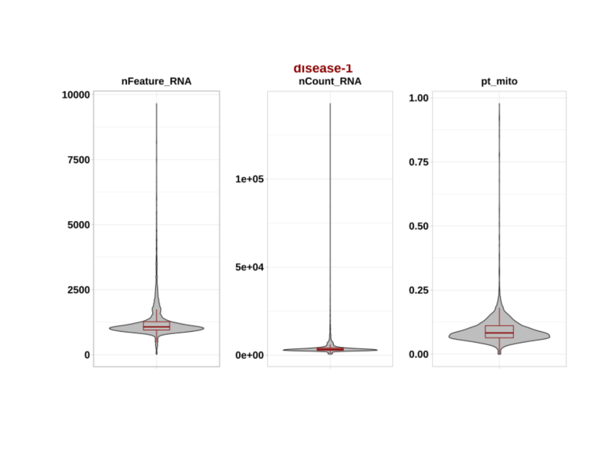  
And after:

``` r

postfilterplots <- system.file(
    "figures",
    "postfilterplots-1.png",
    package = "DOtools"
)

pQC2 <- magick::image_read(postfilterplots)
plot(pQC2)
```

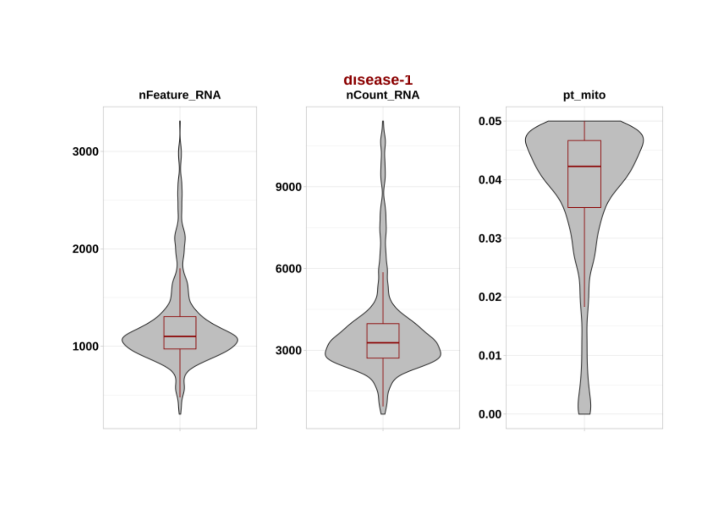 We observed that most cells
were removed due to increased mitochondrial content. Depending on the
experimental design, the mitochondrial content threshold can be adjusted
to retain a higher number of cells, if minimizing cell loss is of
relevance.

  
The DOtools package provides a slim object of this data set. Please feel
free, to use the one created from DO.Import for prettier results or this
slim downed version. We can observe how similar the samples are through
running a correlation analysis.

``` r

# Making sure we have a save folder
base <- tempfile("my_tempdir_")
dir.create(base)

SCE_obj <- readRDS(
    system.file("extdata",
        "sce_data.rds",
        package = "DOtools"
    )
)

DO.Correlation(SCE_obj)
#> Warning: `aes_string()` was deprecated in ggplot2 3.0.0.
#> ℹ Please use tidy evaluation idioms with `aes()`.
#> ℹ See also `vignette("ggplot2-in-packages")` for more information.
#> ℹ The deprecated feature was likely used in the ggcorrplot package.
#>   Please report the issue at <https://github.com/kassambara/ggcorrplot/issues>.
#> This warning is displayed once per session.
#> Call `lifecycle::last_lifecycle_warnings()` to see where this warning was
#> generated.
#> Scale for fill is already present.
#> Adding another scale for fill, which will replace the existing scale.
```

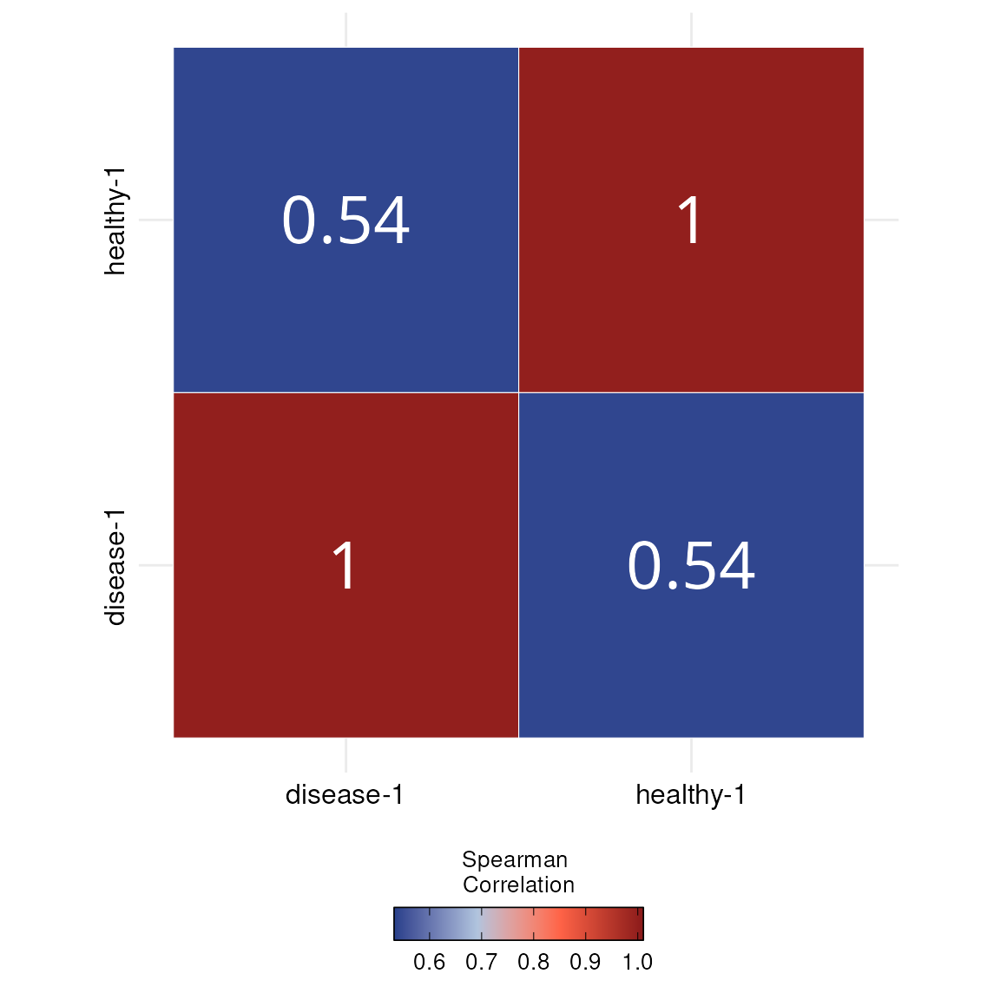

### Data integration

After quality control the preferred integration method can be chosen, we
support every integration method within Seurat’s `IntegrateLayers`
function. Additionally, we implemented a new wrapper function for the
scVI integration from the
[scvi-tools](https://pypi.org/project/scvi-tools/) package. After the
integration completes, we run the Leiden algorithm to find clusters and
generate UMAP embeddings.

``` r

SCE_obj <- DO.Integration(
    sce_object = SCE_obj,
    split_key = "orig.ident",
    HVG = TRUE,
    scale = TRUE,
    pca = TRUE,
    integration_method = "CCAIntegration"
)
#> 2026-06-12 11:28:38 - Splitting object for integration with CCAIntegration by orig.ident
#> 2026-06-12 11:28:39 - Calculating highly variable genes
#> 2026-06-12 11:28:39 - Scaling object
#> 2026-06-12 11:28:39 - Running pca, saved in key: PCA
#> Splitting 'counts', 'data' layers. Not splitting 'scale.data'. If you would like to split other layers, set in `layers` argument.
#> 2026-06-12 11:28:40 - Running integration, saved in key: INTEGRATED.CCA
#> 2026-06-12 11:28:44 - Running Nearest-neighbor graph construction
#> 2026-06-12 11:28:45 - Running cluster detection
#> 2026-06-12 11:28:46 - Creating UMAP
```

``` r

# (Optional) Integration with scVI-Model
SCE_obj <- DO.scVI(
    sce_object = SCE_obj,
    batch_key = "orig.ident",
    layer_counts = "counts",
    layer_logcounts = "logcounts"
)


SNN_Graph <- scran::buildSNNGraph(SCE_obj,
    use.dimred = "scVI"
)

clust_SCVI <- igraph::cluster_louvain(SNN_Graph,
    resolution = 0.3
)

SCE_obj$leiden0.3 <- factor(igraph::membership(clust_SCVI))
SCE_obj <- scater::runUMAP(SCE_obj, dimred = "scVI", name = "UMAP")
```

After the integration finished, both corrected expression matrices can
be found saved in the SCE object and can be used for cluster
calculations and UMAP projections. In this case, we will continue with
the CCA Integration method.

``` r

DO.UMAP(SCE_obj,
    group.by = "leiden0.3"
)
```


``` r


DO.UMAP(SCE_obj,
    group.by = "condition",
    legend.position = "right",
    label = FALSE
)
```


### Semi-automatic annotation with Celltypist

Next up, we implemented a wrapper around the semi-automatic annotation
tool [*celltypist*](https://pypi.org/project/celltypist/). It will
annotate the defined clusters based on the `Adult_COVID19_PBMC.pkl`
model.

``` r

SCE_obj <- DO.CellTypist(SCE_obj,
    modelName = "Healthy_COVID19_PBMC.pkl",
    runCelltypistUpdate = TRUE,
    over_clustering = "leiden0.3"
)
#> 2026-06-12 11:28:53 - Running celltypist using model: Healthy_COVID19_PBMC.pkl
#> 2026-06-12 11:28:53 - Saving celltypist results to temporary folder: /tmp/Rtmpld1w6k/file33445f1f06d013
#> For native R and reading and writing of H5AD files, an R <AnnData> object, and
#> conversion to <SingleCellExperiment> or <Seurat> objects, check out the
#> anndataR package:
#> ℹ Install it from Bioconductor with `BiocManager::install("anndataR")`
#> ℹ See more at <https://bioconductor.org/packages/anndataR/>
#> 2026-06-12 11:29:08 - Creating probality plot
#> 
#> This message is displayed once per session.
DO.UMAP(SCE_obj, group.by = "autoAnnot", legend.position = "right")
```

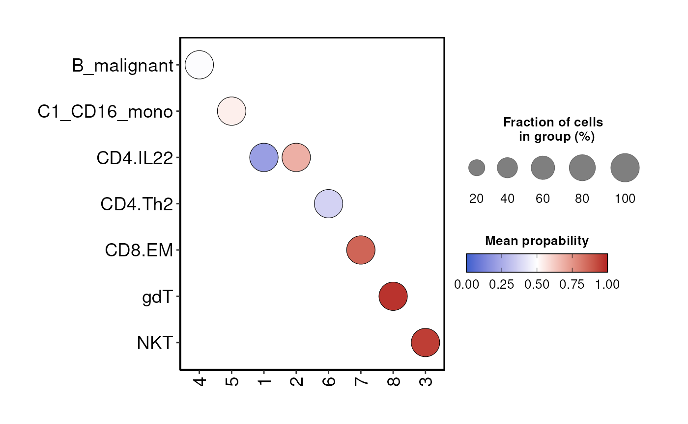

The semi-automatic annotation is a good estimate of the cell types in
your object. But you should always manually validate the findings of the
model. You can manually define a set of marker genes for the cell
population or check the most preeminent genes per cluster by using
scran’s `findMarkers` function. Marker genes can also be visualised
using the `DO.UMAP` function.

``` r

markers_list <- scran::findMarkers(
    SCE_obj,
    test.type = "t",
    groups = SingleCellExperiment::colData(SCE_obj)$autoAnnot,
    direction = "up",
    lfc = 0.25,
    pval.type = "any"
)
#> Warning in .findMarkers(assay(x, i = assay.type), ...): 'findMarkers' is deprecated.
#> Use 'scrapper::scoreMarkers.se' instead.
#> See help("Deprecated")
#> Warning in .local(x, ...): 'pairwiseTTests' is deprecated.
#> See help("Deprecated")
#> Warning in combineMarkers(fit$statistics, fit$pairs, pval.type = pval.type, : 'combineMarkers' is deprecated.
#> Use 'scrapper::summarizeEffects' instead.
#> See help("Deprecated")

# pick top 5 per cluster, naming adjustments
annotation_Markers <- lapply(names(markers_list), function(cluster) {
    df <- as.data.frame(markers_list[[cluster]])
    df$gene <- rownames(df)
    df$cluster <- cluster
    df %>%
        rename(
            avg_log2FC = summary.logFC,
            p_val      = p.value,
            p_val_adj  = FDR
        ) %>%
        dplyr::select(gene, cluster, avg_log2FC, p_val, p_val_adj)
}) %>%
    bind_rows()

# or with seurat if preferred
Seu_obj <- as.Seurat(SCE_obj)
annotation_Markers <- FindAllMarkers(
    object = Seu_obj,
    assay = "RNA",
    group.by = "autoAnnot",
    min.pct = 0.25,
    logfc.threshold = 0.25
)
#> Calculating cluster CD83_CD14_mono
#> Calculating cluster CD4.Naive
#> Calculating cluster CD8.Naive
#> Calculating cluster NK_16hi
#> Calculating cluster CD8.EM
#> Calculating cluster B_naive
#> Calculating cluster pDC

annotation_Markers <- annotation_Markers %>%
    arrange(desc(avg_log2FC)) %>%
    distinct(gene, .keep_all = TRUE) %>%
    group_by(cluster) %>%
    slice_head(n = 5)

p1 <- DO.Dotplot(
    sce_object = SCE_obj,
    Feature = annotation_Markers,
    group.by.x = "leiden0.3",
    plot.margin = c(1, 1, 1, 1),
    annotation_x = TRUE,
    point_stroke = 0.1,
    annotation_x_rev = TRUE,
    textSize = 14,
    hjust = 0.5,
    vjust = 0,
    textRot = 0,
    segWidth = 0.3,
    lwd = 3
)
#> Scale for size is already present.
#> Adding another scale for size, which will replace the existing scale.
p1
```


``` r


# manual set of markers
annotation_Markers <- data.frame(
    cluster = c(
        "ImmuneCells",
        rep("B_cells", 3),
        rep("T_cells", 3),
        rep("NK", 2),
        rep("Myeloid", 3),
        rep("pDC", 3)
    ),
    genes = c(
        "PTPRC", "CD79A", "BANK1", "MS4A1",
        "CD3E", "CD4", "IL7R", "NKG7",
        "KLRD1", "CD68", "CD14", "ITGAM",
        "LILRA4", "CLEC4C", "LRRC26"
    )
)

p2 <- DO.Dotplot(
    sce_object = SCE_obj,
    Feature = annotation_Markers,
    group.by.x = "leiden0.3",
    plot.margin = c(1, 1, 1, 1),
    annotation_x = TRUE,
    point_stroke = 0.1,
    annotation_x_rev = TRUE,
    textSize = 14,
    hjust = 0.5,
    vjust = 0,
    textRot = 0,
    segWidth = 0.3,
    lwd = 3
)
#> Scale for size is already present.
#> Adding another scale for size, which will replace the existing scale.
p2
```


``` r

# Visualise marker expression in UMAP
DO.UMAP(SCE_obj,
    FeaturePlot = TRUE,
    features = "NKG7",
    group.by = "leiden0.3",
    legend.position = "right"
)
```


``` r


DO.UMAP(SCE_obj,
    DensityPlot = TRUE,
    features = "NKG7",
    group.by = "leiden0.3",
    legend.position = "right"
)
#> Warning: Removed 11400 rows containing non-finite outside the scale range
#> (`stat_contour_filled()`).
```


The manual markers for the immune cells show an agreement for the
annotation therefore we can continue with it after some minor
adjustments.

``` r

SCE_obj$annotation <- plyr::revalue(SCE_obj$leiden0.3, c(
    `1` = "T_cells",
    `2` = "T_cells",
    `3` = "NK",
    `4` = "B_cells",
    `5` = "Monocytes",
    `6` = "NK",
    `7` = "T_cells",
    `8` = "pDC"
))

DO.UMAP(SCE_obj, group.by = "annotation", legend.position = "right")
```

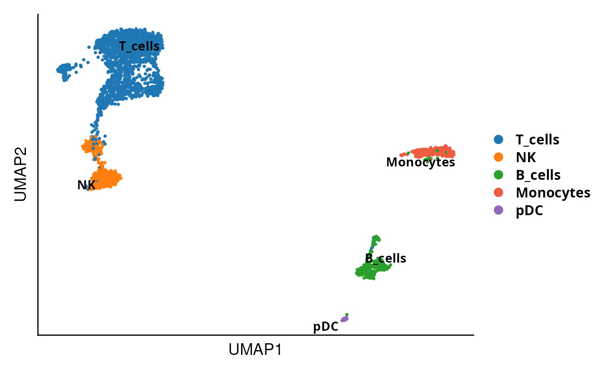

### Cell composition

After the identification of the celltype populations, we can also
evaluate if there are significant changes in these populations in the
healthy and diseased condition using a wrapper function around the
python tool [*scanpro*](https://pypi.org/project/scanpro/).

``` r

DO.CellComposition(SCE_obj,
    assay_normalized = "RNA",
    cluster_column = "annotation",
    sample_column = "orig.ident",
    condition_column = "condition",
    transform_method = "arcsin",
    n_reps = 3
)
#> 2026-06-12 11:29:16 - Bootstrapping method activated with 3 simulated replicates!
#> .
#> Using orig.ident, condition as id variables
#> Using condition as id variables
```


### Reclustering of cell populations

Subpopulations can be tricky to find, therefore it is always a good
practice to perform a reclustering of a given cell populations, if we
are interested in a specific set of cells in a population. Here for
example in the T cells. We will identify the subpopulations and then
markers defining them.

``` r

SCE_obj <- DO.FullRecluster(SCE_obj, over_clustering = "annotation")
#> Computing nearest neighbor graph
#> Computing SNN
#> 1 singletons identified. 2 final clusters.
#> 1 singletons identified. 3 final clusters.
#> 
DO.UMAP(SCE_obj, group.by = "annotation_recluster")
```

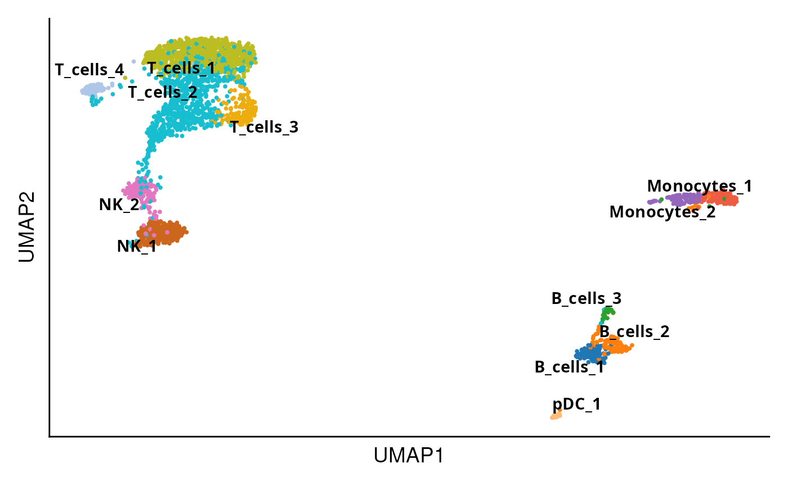

``` r

T_cells <- DO.Subset(SCE_obj,
    ident = "annotation_recluster",
    ident_name = grep("T_cells",
        unique(SCE_obj$annotation_recluster),
        value = TRUE
    )
)
#> 2026-06-12 11:29:33 - Specified 'ident_name': expecting a categorical variable.

T_cells <- DO.CellTypist(T_cells,
    modelName = "Healthy_COVID19_PBMC.pkl",
    runCelltypistUpdate = FALSE,
    over_clustering = "annotation_recluster",
    SeuV5 = FALSE
)
#> 2026-06-12 11:29:33 - Running celltypist using model: Healthy_COVID19_PBMC.pkl
#> 2026-06-12 11:29:33 - Saving celltypist results to temporary folder: /tmp/Rtmpld1w6k/file33445f8f56929
#> 2026-06-12 11:29:45 - Creating probality plot

T_cells$annotation <- plyr::revalue(
    T_cells$annotation_recluster,
    c(
        `T_cells_1` = "CD4_T_cells",
        `T_cells_2` = "CD4_T_cells",
        `T_cells_3` = "CD4_T_cells",
        `T_cells_4` = "CD8_T_cells"
    )
)
```

Now that we identified the marker genes describing the different T cell
populations. We can re-annotate them based on their expression profile
and a new prediciton from Celltypist. After this we, can easily transfer
the labels in the subset to the original object.

``` r

SCE_obj <- DO.TransferLabel(SCE_obj,
    Subset_obj = T_cells,
    annotation_column = "annotation",
    subset_annotation = "annotation"
)

DO.UMAP(SCE_obj, group.by = "annotation", legend.position = "right")
```

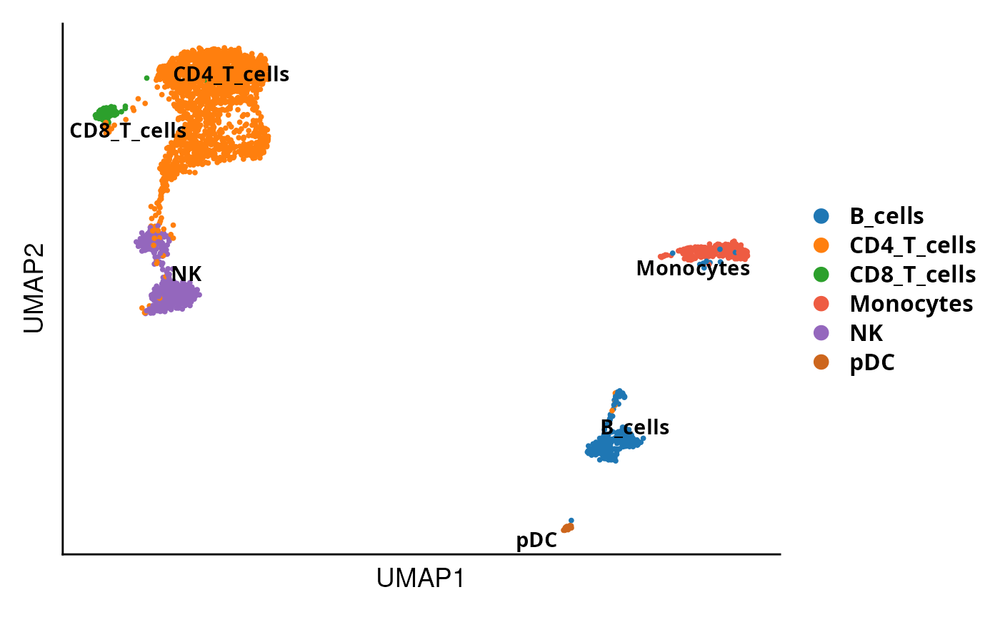

### Gene ontology analysis

To explore which biological processes are enriched in a specific cell
type across conditions, we can perform gene ontology analysis. We’ll
start by identifying differentially expressed genes, focusing here on T
cells. For differential gene expression analysis, we introduced a new
function, which combines DGE analysis using a single cell approach,
e.g. the popular Wilcoxon or MAST test and a pseudobulk testing using
DESeq2 or glmGamPoi. We can then observe the results in a combined
dataframe.

``` r

# this data set contains only one sample per condition
# we introduce replicates for showing the pseudo bulk approach
set.seed(123)
SCE_obj$orig.ident2 <- sample(rep(c("A", "B", "C", "D", "E", "F"),
    length.out = ncol(SCE_obj)
))
CD4T_cells <- DO.Subset(SCE_obj,
    ident = "annotation",
    ident_name = "CD4_T_cells"
)
#> 2026-06-12 11:29:46 - Specified 'ident_name': expecting a categorical variable.

DGE_result <- DO.MultiDGE(CD4T_cells,
    sample_col = "orig.ident2",
    method_sc = "wilcox", #MAST or any test supported by FindMarker function
    method_pb = "DESeq2", # or glmGamPoi
    ident_ctrl = "healthy"
)
#> The following grouping variables have 1 value and will be ignored: annotation
#> Centering and scaling data matrix
#> 2026-06-12 11:29:47 - Annotation names are consistent between original and pseudo-bulk objects.
#> 2026-06-12 11:29:47 - Starting DGE single cell method analysis
#> 2026-06-12 11:29:47 - Comparing disease with healthy in: CD4_T_cells
#> 2026-06-12 11:29:47 - Finished DGE single cell method analysis
#> 2026-06-12 11:29:47 - Starting DGE pseudo bulk method analysis
#> 2026-06-12 11:29:47 - Finished DGE pseudo bulk method analysis
#> 2026-06-12 11:29:47 - DGE pseudo bulk result is empty...

head(DGE_result, 10) %>%
    kable(format = "html", table.attr = "style='width:100%;'") %>%
    kable_styling(bootstrap_options = c(
        "striped",
        "hover",
        "condensed",
        "responsive"
    ))
```

| gene | pct.1 | pct.2 | celltype | condition | avg_log2FC_PB_DESeq2 | avg_log2FC_SC_wilcox | p_val_adj_PB_DESeq2 | p_val_adj_SC_wilcox | p_val_PB_DESeq2 | p_val_SC_wilcox |
|:---|---:|---:|:---|:---|:---|---:|:---|---:|:---|---:|
| RGS1 | 0.823 | 0.056 | CD4_T_cells | disease | NA | 5.985999 | NA | 0 | NA | 0 |
| SRGN | 0.977 | 0.489 | CD4_T_cells | disease | NA | 4.036209 | NA | 0 | NA | 0 |
| ZFP36 | 0.935 | 0.418 | CD4_T_cells | disease | NA | 3.690157 | NA | 0 | NA | 0 |
| FOS | 0.962 | 0.587 | CD4_T_cells | disease | NA | 3.234824 | NA | 0 | NA | 0 |
| RGCC | 0.862 | 0.321 | CD4_T_cells | disease | NA | 3.416695 | NA | 0 | NA | 0 |
| ACTB | 0.977 | 0.998 | CD4_T_cells | disease | NA | -1.930151 | NA | 0 | NA | 0 |
| NR4A2 | 0.565 | 0.072 | CD4_T_cells | disease | NA | 3.896930 | NA | 0 | NA | 0 |
| KLF6 | 0.904 | 0.426 | CD4_T_cells | disease | NA | 2.707374 | NA | 0 | NA | 0 |
| AREG | 0.446 | 0.031 | CD4_T_cells | disease | NA | 4.782775 | NA | 0 | NA | 0 |
| ATF3 | 0.323 | 0.002 | CD4_T_cells | disease | NA | 8.336005 | NA | 0 | NA | 0 |

After inspecting the DGE analysis, we continue with `DO.enrichR`
function, which uses the enrichR API to run gene set enrichment. It
separates the DE genes into up- and down-regulated sets and runs the
analysis for each group independently.

``` r

result_GO <- DO.enrichR(
    df_DGE = DGE_result,
    gene_column = "gene",
    pval_column = "p_val_adj_SC_wilcox",
    log2fc_column = "avg_log2FC_SC_wilcox",
    pval_cutoff = 0.05,
    log2fc_cutoff = 0.25,
    path = NULL,
    filename = "",
    species = "Human",
    go_catgs = "GO_Biological_Process_2023"
)
#> Connection changed to https://maayanlab.cloud/Enrichr/
#> Connection is Live!
#> Uploading data to Enrichr... Done.
#>   Querying GO_Biological_Process_2023... Done.
#> Parsing results... Done.
#> Uploading data to Enrichr... Done.
#>   Querying GO_Biological_Process_2023... Done.
#> Parsing results... Done.

head(result_GO, 5) %>%
    kable(format = "html", table.attr = "style='width:100%;'") %>%
    kable_styling(bootstrap_options = c(
        "striped",
        "hover",
        "condensed",
        "responsive"
    ))
```

| Term | Overlap | P.value | Adjusted.P.value | Old.P.value | Old.Adjusted.P.value | Odds.Ratio | Combined.Score | Genes | Database | State |
|:---|:---|---:|---:|---:|---:|---:|---:|:---|:---|:---|
| Regulation Of Apoptotic Process (<GO:0042981>) | 23/705 | 0 | 2.0e-07 | 0 | 0 | 6.105060 | 138.78136 | TOP2A;EGR1;JUN;EGR3;ANXA1;GADD45B;HSPA5;CITED2;IGFBP3;PLAUR;TNF;DUSP6;GADD45G;RHOB;BCL2L11;BCL6;PMAIP1;PIM3;SGK1;PHLDA1;HSPA1B;MCL1;HSPA1A | GO_Biological_Process_2023 | enriched |
| Regulation Of Transcription By RNA Polymerase II (<GO:0006357>) | 37/2028 | 0 | 2.2e-06 | 0 | 0 | 3.611687 | 70.82183 | CEBPB;CITED2;RORA;PRDM1;TNF;ZFP36;NAMPT;RBBP8;NLRP3;HES4;KDM6B;KLF10;EGR1;JUN;EGR3;TET2;IRF2BP2;FOS;ETV3;SAP30;FOSL2;NR4A2;NFKBIA;NR4A1;KLF6;MAF;RGCC;NR4A3;BCL6;IRF4;ID2;ID1;REL;ID3;FOSB;ATF3;HSPA1A | GO_Biological_Process_2023 | enriched |
| Positive Regulation Of Programmed Cell Death (<GO:0043068>) | 13/245 | 0 | 3.3e-06 | 0 | 0 | 9.486735 | 178.39945 | TOP2A;JUN;GADD45B;IGFBP3;TNF;DUSP6;GADD45G;RHOB;BCL2L11;BCL6;PMAIP1;PHLDA1;MCL1 | GO_Biological_Process_2023 | enriched |
| Response To Glucocorticoid (<GO:0051384>) | 6/26 | 0 | 4.8e-06 | 0 | 0 | 48.417073 | 878.20166 | ZFP36;BCL2L11;ANXA1;TNF;ZFP36L2;ZFP36L1 | GO_Biological_Process_2023 | enriched |
| Positive Regulation Of Apoptotic Process (<GO:0043065>) | 13/270 | 0 | 6.3e-06 | 0 | 0 | 8.552999 | 150.93612 | TOP2A;JUN;GADD45B;IGFBP3;TNF;DUSP6;GADD45G;RHOB;BCL2L11;BCL6;PMAIP1;PHLDA1;MCL1 | GO_Biological_Process_2023 | enriched |

The top significant results can then be visualized in a bar plot.

``` r

result_GO_sig <- result_GO[result_GO$Adjusted.P.value < 0.05, ]
result_GO_sig$celltype <- "CD4T_cells"

DO.SplitBarGSEA(
    df_GSEA = result_GO_sig,
    term_col = "Term",
    col_split = "Combined.Score",
    cond_col = "State",
    pos_cond = "enriched",
    showP = FALSE,
    path = paste0(base, "/")
)
GSEA_plot <- list.files(
    path = base,
    pattern = "SplitBar.*\\.svg$",
    full.names = TRUE,
    recursive = TRUE
)
plot(magick::image_read_svg(GSEA_plot))
```


### Candidate gene visualisation

After performing DGE and GO analyses, discovering whether specific genes
are regulated in a particular disease state and/or cell type is a common
step. To address this, we implemented advanced methods in our functions
that provide summarised results and incorporate statistical testing to
answer these questions efficiently.

The `DO.Dotplot` function covers the expression over three variables at
the same time along with statistical testing. For example, we can
visualise the expression of a gene across cell types and conditions:

``` r

DO.Dotplot(
    sce_object = SCE_obj,
    group.by.x = "condition",
    group.by.y = "annotation",
    Feature = "NKG7",
    stats_y = TRUE
)
#> Calculating cluster B_cells
#> Calculating cluster CD4_T_cells
#> Calculating cluster Monocytes
#> Calculating cluster NK
#> Calculating cluster pDC
#> Calculating cluster T_cells_5
#> Calculating cluster B_cells
#> Calculating cluster CD4_T_cells
#> Calculating cluster CD8_T_cells
#> Calculating cluster Monocytes
#> Calculating cluster NK
#> Calculating cluster pDC
#> Scale for size is already present.
#> Adding another scale for size, which will replace the existing scale.
```

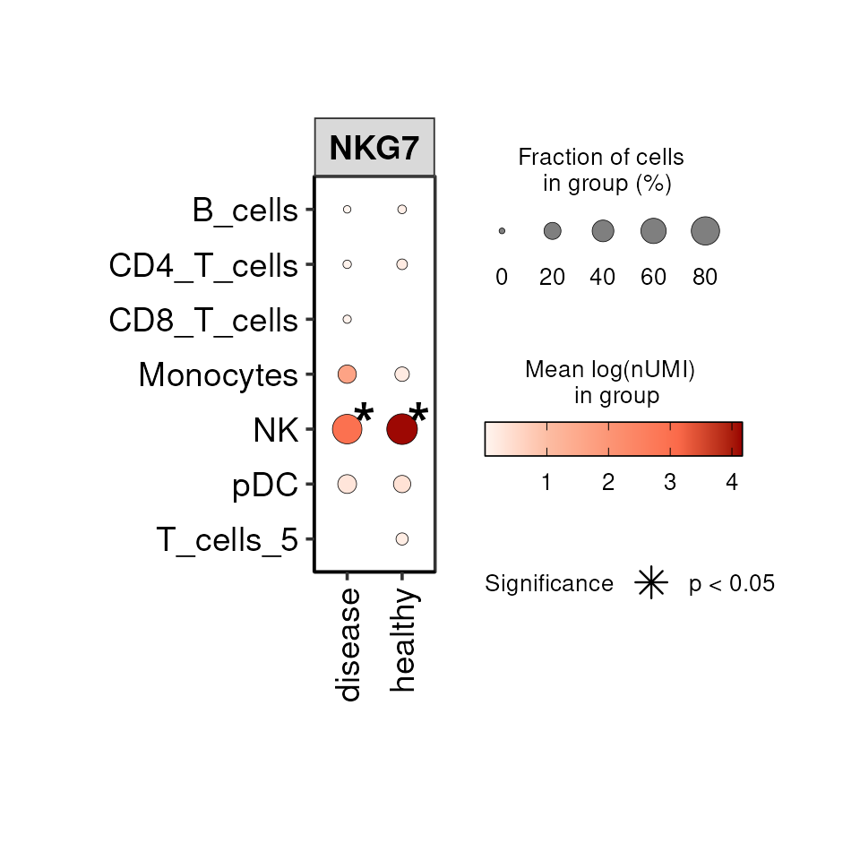

The `DO.Heatmap` function shows the expression of multiple genes in a
publish ready way, including statistical testing:

``` r

path_file <- tempfile("dotools_plots_")
dir.create(path_file, recursive = TRUE, showWarnings = FALSE)

DO.Heatmap(SCE_obj,
    group_by = "leiden0.3",
    features = rownames(SCE_obj)[1:10],
    xticks_rotation = 45,
    path = path_file,
    stats_x_size = 20,
    showP = FALSE,
    figsize = c(8,9)
)
#> Calculating cluster 1
#> Calculating cluster 2
#> Calculating cluster 3
#> Calculating cluster 4
#> Calculating cluster 5
#> Calculating cluster 6
#> Calculating cluster 7
#> Calculating cluster 8

Heatmap_plot <- list.files(
    path = path_file,
    pattern = "Heatmap*\\.svg$",
    full.names = TRUE,
    recursive = TRUE
)

plot(magick::image_read_svg(Heatmap_plot))
```


The `DO.HeatmapFC` function shows the foldchange of expressions of
multiple genes in defined groups in a publication ready way and still
keeping statistical testing for an all-in-one presentation:

``` r

path_file <- tempfile("dotools_plots_")
dir.create(path_file, recursive = TRUE, showWarnings = FALSE)

DO.HeatmapFC(SCE_obj,
    group_by = "leiden0.3",
    features = rownames(SCE_obj)[1:10],
    reference = "healthy",
    condition_key = "condition",
    xticks_rotation = 45,
    path = path_file,
    stats_x_size = 30,
    showP = FALSE,
    ticks_fontproperties = list(size = 14),
    figsize = c(8,7)
)

Heatmap_plot2 <- list.files(
    path = path_file,
    pattern = "Heatmap*\\.svg$",
    full.names = TRUE,
    recursive = TRUE
)

plot(magick::image_read_svg(Heatmap_plot2))
```


We can visualize the average expression of a gene in a cell type +
condition or we can plot continuous metadata information across
conditions with violinplots, barplots and boxplots. Additionally, we can
test for significance.

``` r

SCE_obj_sub <- DO.Subset(SCE_obj,
    ident = "annotation",
    ident_name = c("NK", "CD4_T_cells", "B_cells")
)
#> 2026-06-12 11:30:30 - Specified 'ident_name': expecting a categorical variable.

DO.VlnPlot(SCE_obj_sub,
    Feature = "NKG7",
    group.by = "condition",
    group.by.2 = "annotation",
    ctrl.condition = "healthy"
)
#> Using condition, orig.ident, annotation as id variables
#> 2026-06-12 11:30:31 - ListTest empty, comparing every sample with each other
```

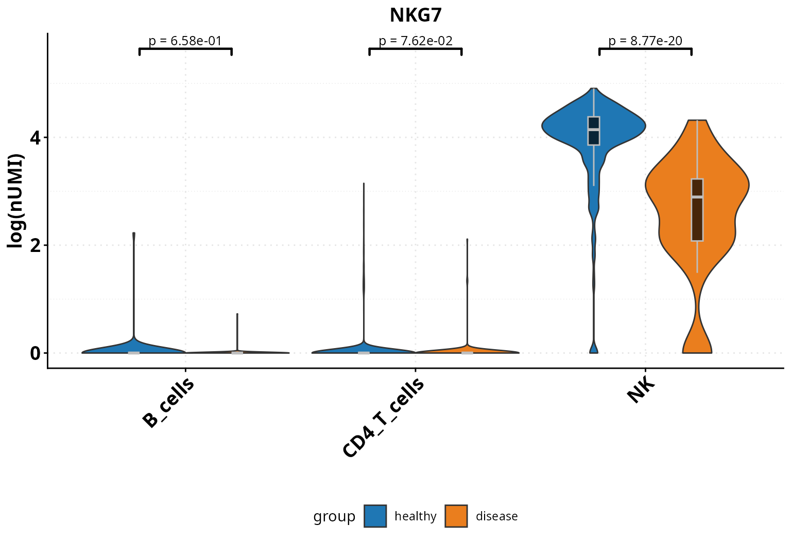

``` r

SCE_obj_NK <- DO.Subset(SCE_obj,
    ident = "annotation",
    ident_name = "NK"
)
#> 2026-06-12 11:30:31 - Specified 'ident_name': expecting a categorical variable.

DO.Barplot(SCE_obj_NK,
    group.by = "condition",
    ctrl.condition = "healthy",
    Feature = "NKG7",
    test_use = "wilcox",
    correction_method = "fdr",
    x_label_rotation = 0
)
#> Using condition, orig.ident as id variables
#> 2026-06-12 11:30:32 - ListTest empty, comparing every sample with each other
```

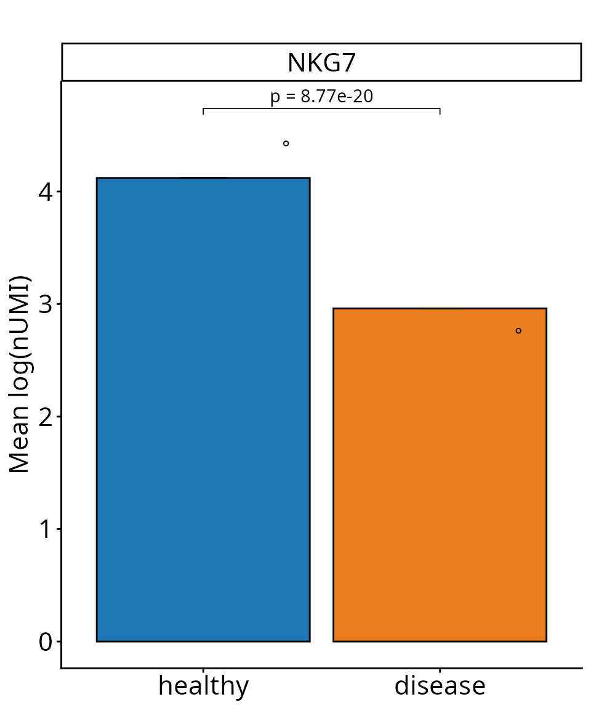

``` r

set.seed(123)
SCE_obj$rdm_sample <- sample(rep(c("A", "B", "C"),
    length.out = ncol(SCE_obj)
))

SCE_obj$LogCounts <- log1p(SCE_obj$nCount_RNA) 

DO.BoxPlot(SCE_obj,
    group.by = "rdm_sample",
    ctrl.condition = "A",
    Feature = "LogCounts",
    step_mod = 0.01,
    stat_pos_mod = 1.001,
    plot_sample = FALSE
)
#> Using group, cluster as id variables
#> 2026-06-12 11:30:32 - ListTest empty, comparing every sample with each other
#> Scale for fill is already present.
#> Adding another scale for fill, which will replace the existing scale.
```

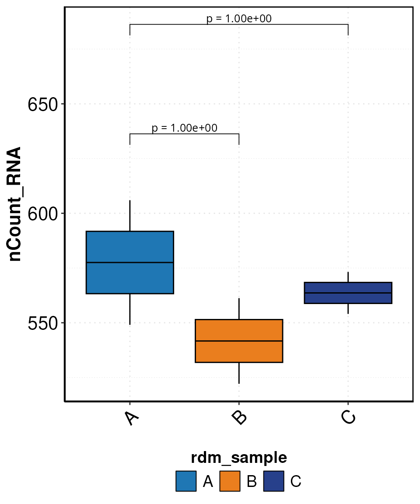

## Session information

    #> ─ Session info ───────────────────────────────────────────────────────────────────────────────────────────────────────
    #>  setting  value
    #>  version  R version 4.6.0 (2026-04-24)
    #>  os       Ubuntu 24.04.4 LTS
    #>  system   x86_64, linux-gnu
    #>  ui       X11
    #>  language en
    #>  collate  en_US.UTF-8
    #>  ctype    en_US.UTF-8
    #>  tz       Europe/Berlin
    #>  date     2026-06-12
    #>  pandoc   3.8.3 @ /usr/lib/rstudio/resources/app/bin/quarto/bin/tools/x86_64/ (via rmarkdown)
    #>  quarto   1.9.36 @ /usr/lib/rstudio/resources/app/bin/quarto/bin/quarto
    #> 
    #> ─ Packages ───────────────────────────────────────────────────────────────────────────────────────────────────────────
    #>  package              * version   date (UTC) lib source
    #>  abind                  1.4-8     2024-09-12 [2] CRAN (R 4.6.0)
    #>  assertthat             0.2.1     2019-03-21 [2] CRAN (R 4.6.0)
    #>  backports              1.5.1     2026-04-03 [2] CRAN (R 4.6.0)
    #>  basilisk               1.24.0    2026-04-28 [2] Bioconductor 3.23 (R 4.6.0)
    #>  beachmat               2.28.0    2026-04-28 [2] Bioconductor 3.23 (R 4.6.0)
    #>  beeswarm               0.4.0     2021-06-01 [2] CRAN (R 4.6.0)
    #>  Biobase              * 2.72.0    2026-04-28 [2] Bioconductor 3.23 (R 4.6.0)
    #>  BiocGenerics         * 0.58.0    2026-04-28 [2] Bioconductor 3.23 (R 4.6.0)
    #>  BiocManager            1.30.27   2025-11-14 [2] CRAN (R 4.6.0)
    #>  BiocNeighbors          2.6.0     2026-04-28 [2] Bioconductor 3.23 (R 4.6.0)
    #>  BiocParallel           1.46.0    2026-04-29 [2] Bioconductor 3.23 (R 4.6.0)
    #>  BiocSingular           1.28.0    2026-04-28 [2] Bioconductor 3.23 (R 4.6.0)
    #>  BiocStyle            * 2.40.0    2026-04-28 [2] Bioconductor 3.23 (R 4.6.0)
    #>  bluster                1.22.0    2026-04-28 [2] Bioconductor 3.23 (R 4.6.0)
    #>  bookdown               0.46      2025-12-05 [2] CRAN (R 4.6.0)
    #>  broom                  1.0.12    2026-01-27 [2] CRAN (R 4.6.0)
    #>  bslib                  0.10.0    2026-01-26 [2] CRAN (R 4.6.0)
    #>  cachem                 1.1.0     2024-05-16 [2] CRAN (R 4.6.0)
    #>  car                    3.1-5     2026-02-03 [2] CRAN (R 4.6.0)
    #>  carData                3.0-6     2026-01-30 [2] CRAN (R 4.6.0)
    #>  cli                    3.6.6     2026-04-09 [2] CRAN (R 4.6.0)
    #>  cluster                2.1.8.2   2026-02-05 [5] CRAN (R 4.5.2)
    #>  codetools              0.2-20    2024-03-31 [5] CRAN (R 4.4.0)
    #>  colorspace             2.1-2     2025-09-22 [2] CRAN (R 4.6.0)
    #>  cowplot                1.2.0     2025-07-07 [2] CRAN (R 4.6.0)
    #>  crayon                 1.5.3     2024-06-20 [2] CRAN (R 4.6.0)
    #>  curl                   7.1.0     2026-04-22 [2] CRAN (R 4.6.0)
    #>  data.table             1.18.4    2026-05-06 [2] CRAN (R 4.6.0)
    #>  DelayedArray           0.38.1    2026-04-30 [2] Bioconductor 3.23 (R 4.6.0)
    #>  DelayedMatrixStats     1.34.0    2026-04-28 [2] Bioconductor 3.23 (R 4.6.0)
    #>  deldir                 2.0-4     2024-02-28 [2] CRAN (R 4.6.0)
    #>  desc                   1.4.3     2023-12-10 [2] CRAN (R 4.6.0)
    #>  DESeq2                 1.52.0    2026-04-28 [2] Bioconductor 3.23 (R 4.6.0)
    #>  digest                 0.6.39    2025-11-19 [2] CRAN (R 4.6.0)
    #>  dir.expiry             1.20.0    2026-04-28 [2] Bioconductor 3.23 (R 4.6.0)
    #>  dotCall64              1.2       2024-10-04 [2] CRAN (R 4.6.0)
    #>  DOtools              * 1.3.2     2026-06-12 [1] Bioconductor
    #>  dplyr                * 1.2.1     2026-04-03 [2] CRAN (R 4.6.0)
    #>  dqrng                  0.4.1     2024-05-28 [2] CRAN (R 4.6.0)
    #>  DropletUtils           1.32.0    2026-04-28 [2] Bioconductor 3.23 (R 4.6.0)
    #>  edgeR                  4.10.0    2026-04-28 [2] Bioconductor 3.23 (R 4.6.0)
    #>  enrichR              * 3.4       2025-02-02 [2] CRAN (R 4.6.0)
    #>  evaluate               1.0.5     2025-08-27 [2] CRAN (R 4.6.0)
    #>  farver                 2.1.2     2024-05-13 [2] CRAN (R 4.6.0)
    #>  fastDummies            1.7.6     2026-04-22 [2] CRAN (R 4.6.0)
    #>  fastmap                1.2.0     2024-05-15 [2] CRAN (R 4.6.0)
    #>  filelock               1.0.3     2023-12-11 [2] CRAN (R 4.6.0)
    #>  fitdistrplus           1.2-6     2026-01-24 [2] CRAN (R 4.6.0)
    #>  FNN                    1.1.4.1   2024-09-22 [2] CRAN (R 4.6.0)
    #>  fontBitstreamVera      0.1.1     2017-02-01 [2] CRAN (R 4.6.0)
    #>  fontLiberation         0.1.0     2016-10-15 [2] CRAN (R 4.6.0)
    #>  fontquiver             0.2.1     2017-02-01 [2] CRAN (R 4.6.0)
    #>  forcats                1.0.1     2025-09-25 [2] CRAN (R 4.6.0)
    #>  Formula                1.2-5     2023-02-24 [2] CRAN (R 4.6.0)
    #>  fs                     2.1.0     2026-04-18 [2] CRAN (R 4.6.0)
    #>  future               * 1.70.0    2026-03-14 [2] CRAN (R 4.6.0)
    #>  future.apply           1.20.2    2026-02-20 [2] CRAN (R 4.6.0)
    #>  gdtools                0.5.0     2026-02-09 [2] CRAN (R 4.6.0)
    #>  generics             * 0.1.4     2025-05-09 [2] CRAN (R 4.6.0)
    #>  GenomicRanges        * 1.64.0    2026-04-28 [2] Bioconductor 3.23 (R 4.6.0)
    #>  ggalluvial             0.12.6    2026-02-22 [2] CRAN (R 4.6.0)
    #>  ggbeeswarm             0.7.3     2025-11-29 [2] CRAN (R 4.6.0)
    #>  ggcorrplot             0.1.4.1   2023-09-05 [2] CRAN (R 4.6.0)
    #>  ggiraph                0.9.6     2026-02-21 [2] CRAN (R 4.6.0)
    #>  ggiraphExtra           0.3.0     2020-10-06 [2] CRAN (R 4.6.0)
    #>  ggplot2              * 4.0.3     2026-04-22 [2] CRAN (R 4.6.0)
    #>  ggpubr                 0.6.3     2026-02-24 [2] CRAN (R 4.6.0)
    #>  ggrastr                1.0.2     2023-06-01 [2] CRAN (R 4.6.0)
    #>  ggrepel                0.9.8     2026-03-17 [2] CRAN (R 4.6.0)
    #>  ggridges               0.5.7     2025-08-27 [2] CRAN (R 4.6.0)
    #>  ggsignif               0.6.4     2022-10-13 [2] CRAN (R 4.6.0)
    #>  ggtext                 0.1.2     2022-09-16 [2] CRAN (R 4.6.0)
    #>  globals                0.19.1    2026-03-13 [2] CRAN (R 4.6.0)
    #>  glue                   1.8.1     2026-04-17 [2] CRAN (R 4.6.0)
    #>  goftest                1.2-3     2021-10-07 [2] CRAN (R 4.6.0)
    #>  gridExtra              2.3       2017-09-09 [2] CRAN (R 4.6.0)
    #>  gridtext               0.1.6     2026-02-19 [2] CRAN (R 4.6.0)
    #>  gtable                 0.3.6     2024-10-25 [2] CRAN (R 4.6.0)
    #>  h5mread                1.4.0     2026-04-28 [2] Bioconductor 3.23 (R 4.6.0)
    #>  HDF5Array              1.40.0    2026-04-28 [2] Bioconductor 3.23 (R 4.6.0)
    #>  hms                    1.1.4     2025-10-17 [2] CRAN (R 4.6.0)
    #>  htmltools              0.5.9     2025-12-04 [2] CRAN (R 4.6.0)
    #>  htmlwidgets            1.6.4     2023-12-06 [2] CRAN (R 4.6.0)
    #>  httpuv                 1.6.17    2026-03-18 [2] CRAN (R 4.6.0)
    #>  httr                   1.4.8     2026-02-13 [2] CRAN (R 4.6.0)
    #>  ica                    1.0-3     2022-07-08 [2] CRAN (R 4.6.0)
    #>  igraph                 2.3.1     2026-05-04 [2] CRAN (R 4.6.0)
    #>  insight                1.5.0     2026-04-14 [2] CRAN (R 4.6.0)
    #>  IRanges              * 2.46.0    2026-04-28 [2] Bioconductor 3.23 (R 4.6.0)
    #>  irlba                  2.3.7     2026-01-30 [2] CRAN (R 4.6.0)
    #>  isoband                0.3.0     2025-12-07 [2] CRAN (R 4.6.0)
    #>  jquerylib              0.1.4     2021-04-26 [2] CRAN (R 4.6.0)
    #>  jsonlite               2.0.0     2025-03-27 [2] CRAN (R 4.6.0)
    #>  kableExtra           * 1.4.0     2024-01-24 [2] CRAN (R 4.6.0)
    #>  KernSmooth             2.23-26   2025-01-01 [5] CRAN (R 4.4.2)
    #>  knitr                  1.51      2025-12-20 [2] CRAN (R 4.6.0)
    #>  ks                     1.15.1    2025-05-04 [2] CRAN (R 4.6.0)
    #>  labeling               0.4.3     2023-08-29 [2] CRAN (R 4.6.0)
    #>  later                  1.4.8     2026-03-05 [2] CRAN (R 4.6.0)
    #>  lattice                0.22-9    2026-02-09 [5] CRAN (R 4.5.2)
    #>  lazyeval               0.2.3     2026-04-04 [2] CRAN (R 4.6.0)
    #>  leidenbase             0.1.36    2025-12-16 [2] CRAN (R 4.6.0)
    #>  lifecycle              1.0.5     2026-01-08 [2] CRAN (R 4.6.0)
    #>  limma                  3.68.1    2026-05-03 [2] Bioconductor 3.23 (R 4.6.0)
    #>  listenv                0.10.1    2026-03-10 [2] CRAN (R 4.6.0)
    #>  lmtest                 0.9-40    2022-03-21 [2] CRAN (R 4.6.0)
    #>  locfit                 1.5-9.12  2025-03-05 [2] CRAN (R 4.6.0)
    #>  magick                 2.9.1     2026-02-28 [2] CRAN (R 4.6.0)
    #>  magrittr               2.0.5     2026-04-04 [2] CRAN (R 4.6.0)
    #>  MASS                   7.3-65    2025-02-28 [5] CRAN (R 4.4.3)
    #>  Matrix                 1.7-5     2026-03-21 [5] CRAN (R 4.5.3)
    #>  MatrixGenerics       * 1.24.0    2026-04-28 [2] Bioconductor 3.23 (R 4.6.0)
    #>  matrixStats          * 1.5.0     2025-01-07 [2] CRAN (R 4.6.0)
    #>  mclust                 6.1.2     2025-10-31 [2] CRAN (R 4.6.0)
    #>  metapod                1.20.0    2026-04-28 [2] Bioconductor 3.23 (R 4.6.0)
    #>  mgcv                   1.9-4     2025-11-07 [5] CRAN (R 4.5.2)
    #>  mime                   0.13      2025-03-17 [2] CRAN (R 4.6.0)
    #>  miniUI                 0.1.2     2025-04-17 [2] CRAN (R 4.6.0)
    #>  mvtnorm                1.3-7     2026-04-15 [2] CRAN (R 4.6.0)
    #>  mycor                  0.1.1     2018-04-10 [2] CRAN (R 4.6.0)
    #>  nlme                   3.1-169   2026-03-27 [5] CRAN (R 4.5.3)
    #>  openxlsx               4.2.8.1   2025-10-31 [2] CRAN (R 4.6.0)
    #>  otel                   0.2.0     2025-08-29 [2] CRAN (R 4.6.0)
    #>  parallelly             1.47.0    2026-04-17 [2] CRAN (R 4.6.0)
    #>  patchwork              1.3.2     2025-08-25 [2] CRAN (R 4.6.0)
    #>  pbapply                1.7-4     2025-07-20 [2] CRAN (R 4.6.0)
    #>  pillar                 1.11.1    2025-09-17 [2] CRAN (R 4.6.0)
    #>  pkgconfig              2.0.3     2019-09-22 [2] CRAN (R 4.6.0)
    #>  pkgdown                2.2.0     2025-11-06 [2] CRAN (R 4.6.0)
    #>  plotly                 4.12.0    2026-01-24 [2] CRAN (R 4.6.0)
    #>  plyr                 * 1.8.9     2023-10-02 [2] CRAN (R 4.6.0)
    #>  png                    0.1-9     2026-03-15 [2] CRAN (R 4.6.0)
    #>  polyclip               1.10-7    2024-07-23 [2] CRAN (R 4.6.0)
    #>  ppcor                  1.1       2015-12-03 [2] CRAN (R 4.6.0)
    #>  pracma                 2.4.6     2025-10-22 [2] CRAN (R 4.6.0)
    #>  presto                 1.0.0     2026-05-05 [2] Github (immunogenomics/presto@7636b3d)
    #>  prettyunits            1.2.0     2023-09-24 [2] CRAN (R 4.6.0)
    #>  progress               1.2.3     2023-12-06 [2] CRAN (R 4.6.0)
    #>  progressr              0.19.0    2026-03-31 [2] CRAN (R 4.6.0)
    #>  promises               1.5.0     2025-11-01 [2] CRAN (R 4.6.0)
    #>  purrr                  1.2.2     2026-04-10 [2] CRAN (R 4.6.0)
    #>  R.methodsS3            1.8.2     2022-06-13 [2] CRAN (R 4.6.0)
    #>  R.oo                   1.27.1    2025-05-02 [2] CRAN (R 4.6.0)
    #>  R.utils                2.13.0    2025-02-24 [2] CRAN (R 4.6.0)
    #>  R6                     2.6.1     2025-02-15 [2] CRAN (R 4.6.0)
    #>  ragg                   1.5.2     2026-03-23 [2] CRAN (R 4.6.0)
    #>  RANN                   2.6.2     2024-08-25 [2] CRAN (R 4.6.0)
    #>  RColorBrewer           1.1-3     2022-04-03 [2] CRAN (R 4.6.0)
    #>  Rcpp                   1.1.1-1.1 2026-04-24 [2] CRAN (R 4.6.0)
    #>  RcppAnnoy              0.0.23    2026-01-12 [2] CRAN (R 4.6.0)
    #>  RcppHNSW               0.6.0     2024-02-04 [2] CRAN (R 4.6.0)
    #>  reshape2               1.4.5     2025-11-12 [2] CRAN (R 4.6.0)
    #>  reticulate             1.46.0    2026-04-09 [2] CRAN (R 4.6.0)
    #>  rhdf5                  2.56.0    2026-04-28 [2] Bioconductor 3.23 (R 4.6.0)
    #>  rhdf5filters           1.24.0    2026-04-28 [2] Bioconductor 3.23 (R 4.6.0)
    #>  Rhdf5lib               2.0.0     2026-04-28 [2] Bioconductor 3.23 (R 4.6.0)
    #>  rjson                  0.2.23    2024-09-16 [2] CRAN (R 4.6.0)
    #>  rlang                  1.2.0     2026-04-06 [2] CRAN (R 4.6.0)
    #>  rmarkdown              2.31      2026-03-26 [2] CRAN (R 4.6.0)
    #>  ROCR                   1.0-12    2026-01-23 [2] CRAN (R 4.6.0)
    #>  RSpectra               0.16-2    2024-07-18 [2] CRAN (R 4.6.0)
    #>  rstatix                0.7.3     2025-10-18 [2] CRAN (R 4.6.0)
    #>  rstudioapi             0.18.0    2026-01-16 [2] CRAN (R 4.6.0)
    #>  rsvd                   1.0.5     2021-04-16 [2] CRAN (R 4.6.0)
    #>  rsvg                   2.7.0     2025-09-08 [2] CRAN (R 4.6.0)
    #>  Rtsne                  0.17      2023-12-07 [2] CRAN (R 4.6.0)
    #>  S4Arrays               1.12.0    2026-04-28 [2] Bioconductor 3.23 (R 4.6.0)
    #>  S4Vectors            * 0.50.0    2026-04-28 [2] Bioconductor 3.23 (R 4.6.0)
    #>  S7                     0.2.2     2026-04-22 [2] CRAN (R 4.6.0)
    #>  sass                   0.4.10    2025-04-11 [2] CRAN (R 4.6.0)
    #>  ScaledMatrix           1.20.0    2026-04-28 [2] Bioconductor 3.23 (R 4.6.0)
    #>  scales                 1.4.0     2025-04-24 [2] CRAN (R 4.6.0)
    #>  scater               * 1.40.0    2026-04-28 [2] Bioconductor 3.23 (R 4.6.0)
    #>  scattermore            1.2       2023-06-12 [2] CRAN (R 4.6.0)
    #>  SCpubr                 3.0.1     2026-01-09 [2] CRAN (R 4.6.0)
    #>  scran                * 1.40.0    2026-04-28 [2] Bioconductor 3.23 (R 4.6.0)
    #>  sctransform            0.4.3     2026-01-10 [2] CRAN (R 4.6.0)
    #>  scuttle              * 1.22.0    2026-04-28 [2] Bioconductor 3.23 (R 4.6.0)
    #>  Seqinfo              * 1.2.0     2026-04-28 [2] Bioconductor 3.23 (R 4.6.0)
    #>  sessioninfo            1.2.3     2025-02-05 [2] CRAN (R 4.6.0)
    #>  Seurat               * 5.5.0     2026-04-22 [2] CRAN (R 4.6.0)
    #>  SeuratObject         * 5.4.0     2026-04-11 [2] CRAN (R 4.6.0)
    #>  shiny                  1.13.0    2026-02-20 [2] CRAN (R 4.6.0)
    #>  SingleCellExperiment * 1.34.0    2026-04-28 [2] Bioconductor 3.23 (R 4.6.0)
    #>  sjlabelled             1.2.0     2022-04-10 [2] CRAN (R 4.6.0)
    #>  sjmisc                 2.8.11    2025-07-30 [2] CRAN (R 4.6.0)
    #>  sp                   * 2.2-1     2026-02-13 [2] CRAN (R 4.6.0)
    #>  spam                   2.11-3    2026-01-08 [2] CRAN (R 4.6.0)
    #>  SparseArray            1.12.2    2026-05-01 [2] Bioconductor 3.23 (R 4.6.0)
    #>  sparseMatrixStats      1.24.0    2026-04-28 [2] Bioconductor 3.23 (R 4.6.0)
    #>  spatstat.data          3.1-9     2025-10-18 [2] CRAN (R 4.6.0)
    #>  spatstat.explore       3.8-0     2026-03-22 [2] CRAN (R 4.6.0)
    #>  spatstat.geom          3.7-3     2026-03-23 [2] CRAN (R 4.6.0)
    #>  spatstat.random        3.4-5     2026-03-22 [2] CRAN (R 4.6.0)
    #>  spatstat.sparse        3.1-0     2024-06-21 [2] CRAN (R 4.6.0)
    #>  spatstat.univar        3.1-7     2026-03-18 [2] CRAN (R 4.6.0)
    #>  spatstat.utils         3.2-2     2026-03-10 [2] CRAN (R 4.6.0)
    #>  statmod                1.5.1     2025-10-09 [2] CRAN (R 4.6.0)
    #>  stringi                1.8.7     2025-03-27 [2] CRAN (R 4.6.0)
    #>  stringr                1.6.0     2025-11-04 [2] CRAN (R 4.6.0)
    #>  SummarizedExperiment * 1.42.0    2026-04-28 [2] Bioconductor 3.23 (R 4.6.0)
    #>  survival               3.8-6     2026-01-16 [5] CRAN (R 4.5.2)
    #>  svglite                2.2.2     2025-10-21 [2] CRAN (R 4.6.0)
    #>  systemfonts            1.3.2     2026-03-05 [2] CRAN (R 4.6.0)
    #>  tensor                 1.5.1     2025-06-17 [2] CRAN (R 4.6.0)
    #>  textshaping            1.0.5     2026-03-06 [2] CRAN (R 4.6.0)
    #>  tibble               * 3.3.1     2026-01-11 [2] CRAN (R 4.6.0)
    #>  tidyr                  1.3.2     2025-12-19 [2] CRAN (R 4.6.0)
    #>  tidyselect             1.2.1     2024-03-11 [2] CRAN (R 4.6.0)
    #>  tidyverse              2.0.0     2023-02-22 [2] CRAN (R 4.6.0)
    #>  uwot                   0.2.4     2025-11-10 [2] CRAN (R 4.6.0)
    #>  vctrs                  0.7.3     2026-04-11 [2] CRAN (R 4.6.0)
    #>  vipor                  0.4.7     2023-12-18 [2] CRAN (R 4.6.0)
    #>  viridis                0.6.5     2024-01-29 [2] CRAN (R 4.6.0)
    #>  viridisLite            0.4.3     2026-02-04 [2] CRAN (R 4.6.0)
    #>  withr                  3.0.2     2024-10-28 [2] CRAN (R 4.6.0)
    #>  WriteXLS               6.8.0     2025-05-22 [2] CRAN (R 4.6.0)
    #>  xfun                   0.57      2026-03-20 [2] CRAN (R 4.6.0)
    #>  xml2                   1.5.2     2026-01-17 [2] CRAN (R 4.6.0)
    #>  xtable                 1.8-8     2026-02-22 [2] CRAN (R 4.6.0)
    #>  XVector                0.52.0    2026-04-28 [2] Bioconductor 3.23 (R 4.6.0)
    #>  yaml                   2.3.12    2025-12-10 [2] CRAN (R 4.6.0)
    #>  zellkonverter          1.22.0    2026-04-29 [2] Bioconductor 3.23 (R 4.6.0)
    #>  zip                    2.3.3     2025-05-13 [2] CRAN (R 4.6.0)
    #>  zoo                    1.8-15    2025-12-15 [2] CRAN (R 4.6.0)
    #> 
    #>  [1] /tmp/RtmpXoXuVS/temp_libpath2294e3e9e8d47
    #>  [2] /home/mariano/R/x86_64-pc-linux-gnu-library/4.6
    #>  [3] /usr/local/lib/R/site-library
    #>  [4] /usr/lib/R/site-library
    #>  [5] /usr/lib/R/library
    #>  * ── Packages attached to the search path.
    #> 
    #> ─ Python configuration ───────────────────────────────────────────────────────────────────────────────────────────────
    #>  python:         /home/mariano/.cache/R/basilisk/1.24.0/zellkonverter/1.22.0/zellkonverterAnnDataEnv-0.12.3/bin/python
    #>  libpython:      /home/mariano/.pyenv/versions/3.14.0/lib/libpython3.14.so
    #>  pythonhome:     /home/mariano/.cache/R/basilisk/1.24.0/zellkonverter/1.22.0/zellkonverterAnnDataEnv-0.12.3:/home/mariano/.cache/R/basilisk/1.24.0/zellkonverter/1.22.0/zellkonverterAnnDataEnv-0.12.3
    #>  version:        3.14.0 (main, Nov 10 2025, 15:54:24) [GCC 13.3.0]
    #>  numpy:          /home/mariano/.cache/R/basilisk/1.24.0/zellkonverter/1.22.0/zellkonverterAnnDataEnv-0.12.3/lib/python3.14/site-packages/numpy
    #>  numpy_version:  2.3.4
    #>  
    #>  NOTE: Python version was forced by use_python() function
    #> 
    #> ──────────────────────────────────────────────────────────────────────────────────────────────────────────────────────
